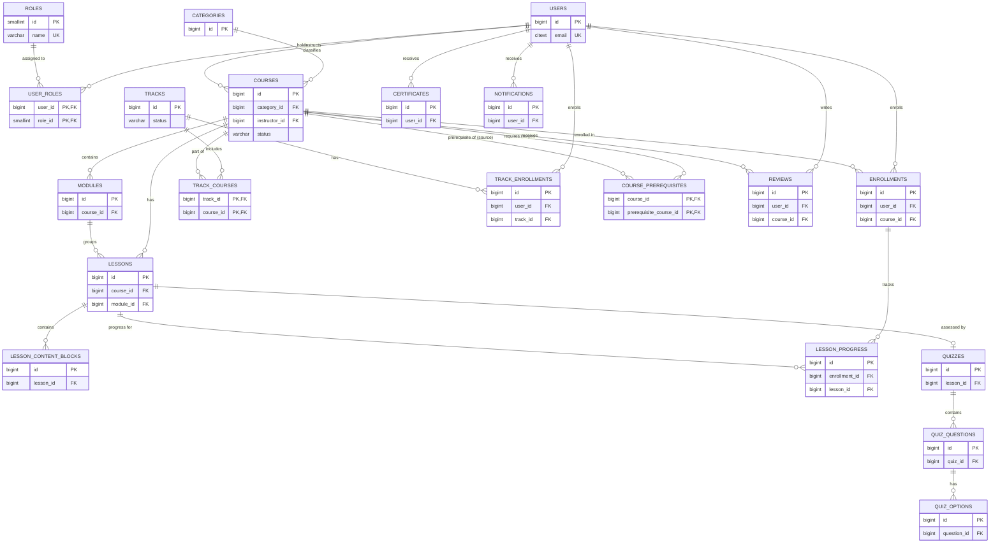
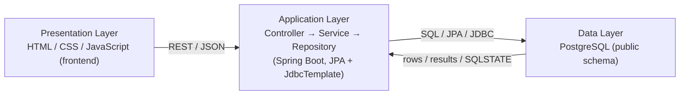
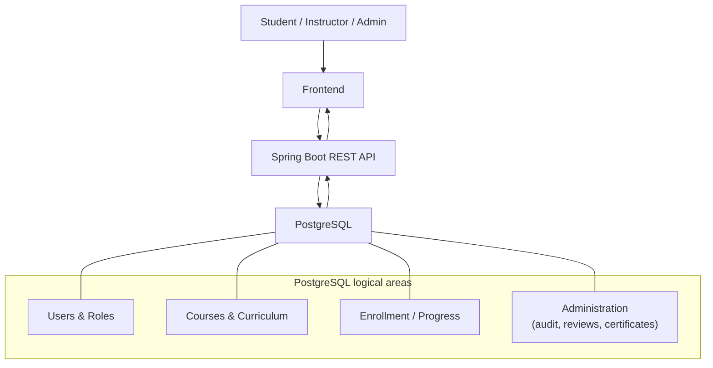
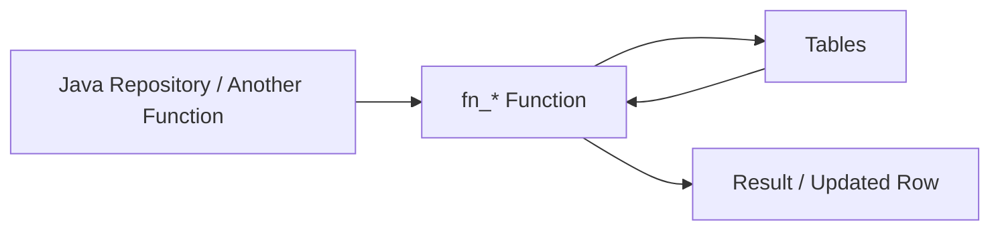
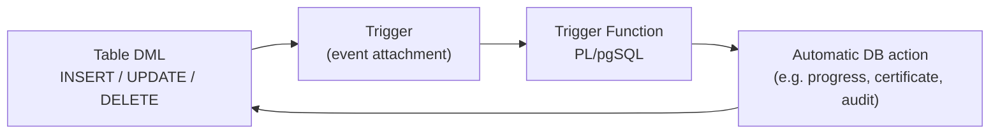
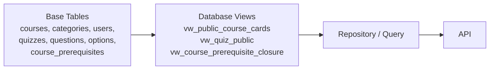
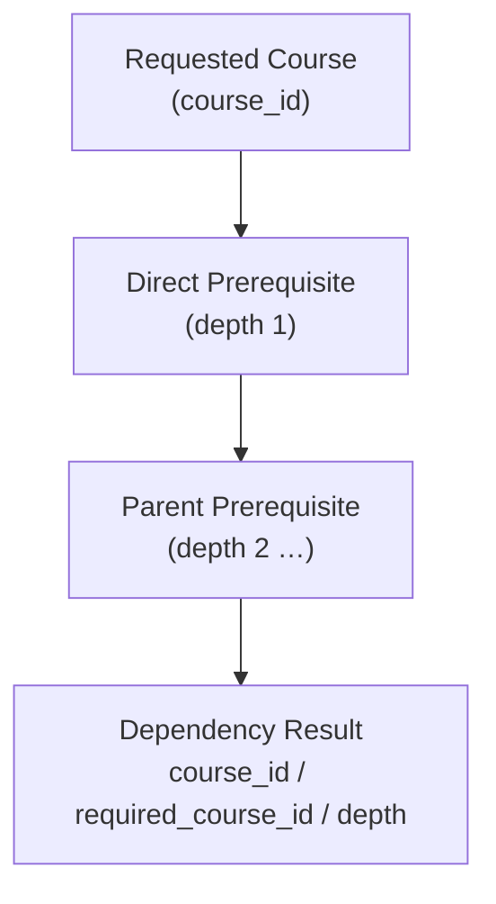
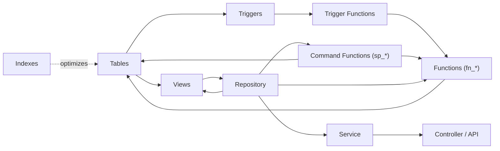
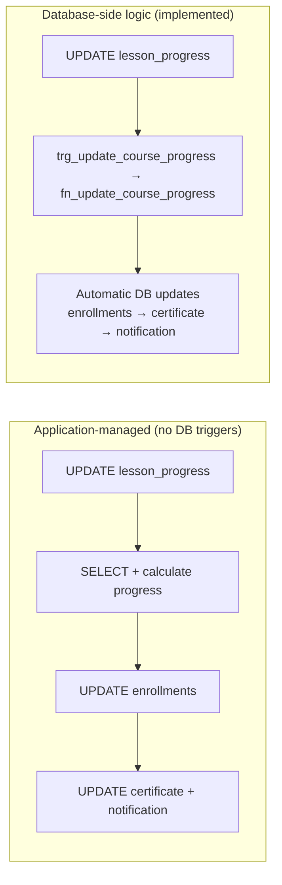

# Learnova Database Documentation

> Documentation of the **implemented** PostgreSQL database architecture of the Learnova learning platform.
> Source of truth: the Flyway migration set `src/main/resources/db/migration/V1 … V22`
> (the feature files under `database/` are the human-readable mirror of the same schema).
> Only objects that actually exist in the schema and code are documented here.

---

# 1. System Database Overview

Learnova is a course marketplace / learning platform. Its PostgreSQL database stores:

* **Users and access** – `users`, `roles`, `user_roles` (M:N junction), `instructor_requests` (instructor approval workflow), `audit_logs` (append-only change history with JSONB before/after values).
* **Course catalogue and authoring** – `categories`, `courses` (with lifecycle status, full-text search vector and denormalized aggregates), `modules`, `lessons`, `lesson_content_blocks`, `course_tags` + `course_tag_map`.
* **Learning paths and enrollments** – `tracks`, `track_courses`, `enrollments`, `track_enrollments`, `lesson_progress`.
* **Prerequisites** – `course_prerequisites` (a directed course-to-course dependency graph) and `course_bypasses` (a prerequisite satisfied by passing its quiz).
* **Assessment** – `quizzes`, `quiz_questions`, `quiz_options`, regular `quiz_attempts` (+ snapshots/answers) and bypass `bypass_attempts` (+ snapshots/answers), `quiz_submissions` history.
* **Engagement** – `reviews` (with aggregated rating on the course row), `certificates`, `notifications`.

**How the main entities relate:** a `user` (student/instructor/admin) is connected to `courses` through `enrollments`; a `course` contains a hierarchy of `modules` → `lessons` → `lesson_content_blocks`; `lesson_progress` connects an `enrollment` to a `lesson`; `courses` may depend on other `courses` via `course_prerequisites`; `tracks` group `courses` and have their own enrollments.

**PostgreSQL/RDBMS features used:** `citext`, `pg_trgm`, `unaccent` extensions; identity/serial keys; named `CHECK`, `UNIQUE`, and `FOREIGN KEY` constraints; composite primary keys; junction tables; expression and partial indexes; `GIN` indexes over `TSVECTOR` and trigram; PostgreSQL full-text search (`websearch_to_tsquery`, `ts_rank_cd`); `JSONB` columns (audit logs, quiz view, curriculum replace payload); SQL and PL/pgSQL functions; trigger functions and triggers; a **recursive CTE** for prerequisite closure and cycle detection; custom `LTxxx` SQLSTATE error codes; `RAISE LOG` / `LT500` error translation; session settings (`app.user_id`) for auditing.

The schema is deployed by Flyway migrations. The application (Spring Boot) talks to it with **JPA** (auth/user/role entities) and **JdbcTemplate / NamedParameterJdbcTemplate** calling the `fn_*` query functions and `sp_*` command functions.

---

# 2. Complete Implemented Schema ER Diagram

```mermaid
erDiagram

    USERS {
        bigint id PK
        citext email UK
        varchar first_name
        varchar last_name
        varchar account_status
    }

    ROLES {
        smallint id PK
        varchar name UK
    }

    USER_ROLES {
        bigint user_id PK, FK
        smallint role_id PK, FK
        bigint granted_by FK
    }

    INSTRUCTOR_REQUESTS {
        bigint id PK
        bigint user_id FK
        varchar status
        bigint reviewed_by FK
    }

    CATEGORIES {
        bigint id PK
        varchar name UK
        varchar slug UK
        boolean is_active
    }

    COURSES {
        bigint id PK
        varchar slug UK
        bigint category_id FK
        bigint instructor_id FK
        bigint published_by FK
        varchar status
        numeric avg_rating
        tsvector search_vector
    }

    MODULES {
        bigint id PK
        bigint course_id FK
        varchar title
        int sequence_order
    }

    LESSONS {
        bigint id PK
        bigint course_id FK
        bigint module_id FK
        varchar title
        int sequence_order
        boolean is_preview
    }

    LESSON_CONTENT_BLOCKS {
        bigint id PK
        bigint lesson_id FK
        varchar block_type
        int sequence_order
    }

    COURSE_TAGS {
        bigint id PK
        varchar name UK
        varchar slug UK
    }

    COURSE_TAG_MAP {
        bigint course_id PK, FK
        bigint tag_id PK, FK
    }

    TRACKS {
        bigint id PK
        varchar title
        varchar status
    }

    TRACK_COURSES {
        bigint track_id PK, FK
        bigint course_id PK, FK
        int sequence_order
    }

    ENROLLMENTS {
        bigint id PK
        bigint user_id FK
        bigint course_id FK
        varchar status
        numeric progress_pct
        varchar source
    }

    TRACK_ENROLLMENTS {
        bigint id PK
        bigint user_id FK
        bigint track_id FK
        varchar status
        numeric progress_pct
    }

    LESSON_PROGRESS {
        bigint id PK
        bigint enrollment_id FK
        bigint lesson_id FK
        varchar status
    }

    COURSE_PREREQUISITES {
        bigint course_id PK, FK
        bigint prerequisite_course_id PK, FK
        numeric required_min_score
    }

    COURSE_BYPASSES {
        bigint user_id PK, FK
        bigint target_course_id PK, FK
        bigint prerequisite_course_id PK, FK
    }

    QUIZZES {
        bigint id PK
        bigint lesson_id FK, UK
        numeric passing_score
        int questions_per_attempt
    }

    QUIZ_QUESTIONS {
        bigint id PK
        bigint quiz_id FK
        text question_text
        int sequence_order
    }

    QUIZ_OPTIONS {
        bigint id PK
        bigint question_id FK
        varchar option_label
        boolean is_correct
    }

    QUIZ_ATTEMPTS {
        bigint id PK
        bigint enrollment_id FK
        bigint quiz_id FK
        varchar status
        numeric score_pct
    }

    QUIZ_ATTEMPT_QUESTIONS {
        bigint attempt_id PK, FK
        bigint question_id PK, FK
    }

    ATTEMPT_ANSWERS {
        bigint attempt_id PK, FK
        bigint question_id PK, FK
        bigint selected_option_id FK
        boolean is_correct
    }

    BYPASS_ATTEMPTS {
        bigint id PK
        bigint user_id FK
        bigint target_course_id FK
        bigint prerequisite_course_id FK
        varchar status
        numeric score_pct
    }

    BYPASS_ATTEMPT_QUESTIONS {
        bigint attempt_id PK, FK
        bigint source_question_id PK, FK
    }

    BYPASS_ATTEMPT_ANSWERS {
        bigint attempt_id PK, FK
        bigint source_question_id PK, FK
        bigint selected_option_id FK
        boolean is_correct
    }

    QUIZ_SUBMISSIONS {
        bigint id PK
        bigint user_id FK
        bigint quiz_id FK
        numeric score_pct
        boolean passed
    }

    REVIEWS {
        bigint id PK
        bigint user_id FK
        bigint course_id FK
        smallint rating
    }

    CERTIFICATES {
        bigint id PK
        bigint user_id FK
        varchar type
        bigint course_id FK
        bigint track_id FK
        varchar cert_code UK
    }

    NOTIFICATIONS {
        bigint id PK
        bigint user_id FK
        text message
        boolean is_read
    }

    AUDIT_LOGS {
        bigint id PK
        varchar table_name
        bigint record_id
        varchar action
        jsonb old_values
        jsonb new_values
        bigint performed_by FK
    }

    USERS ||--o{ USER_ROLES : "has"
    ROLES ||--o{ USER_ROLES : "assigned to"
    USERS ||--o{ INSTRUCTOR_REQUESTS : "submits"
    USERS ||--o{ COURSES : "instructs"
    CATEGORIES ||--o{ COURSES : "classifies"
    USERS ||--o{ ENROLLMENTS : "enrolls"
    COURSES ||--o{ ENROLLMENTS : "enrolled in"
    COURSES ||--o{ MODULES : "contains"
    COURSES ||--o{ LESSONS : "has"
    MODULES ||--o{ LESSONS : "groups"
    LESSONS ||--o{ LESSON_CONTENT_BLOCKS : "contains"
    COURSES ||--o{ COURSE_TAG_MAP : "tagged"
    COURSE_TAGS ||--o{ COURSE_TAG_MAP : "used by"
    TRACKS ||--o{ TRACK_COURSES : "includes"
    COURSES ||--o{ TRACK_COURSES : "part of"
    TRACKS ||--o{ TRACK_ENROLLMENTS : "has"
    USERS ||--o{ TRACK_ENROLLMENTS : "enrolls"
    ENROLLMENTS ||--o{ LESSON_PROGRESS : "tracks"
    LESSONS ||--o{ LESSON_PROGRESS : "progress for"
    COURSES ||--o{ COURSE_PREREQUISITES : "requires (target)"
    COURSES ||--o{ COURSE_PREREQUISITES : "prerequisite of (source)"
    USERS ||--o{ COURSE_BYPASSES : "bypasses"
    COURSES ||--o{ COURSE_BYPASSES : "target of"
    COURSES ||--o{ COURSE_BYPASSES : "prerequisite bypassed"
    LESSONS ||--o| QUIZZES : "assessed by"
    QUIZZES ||--o{ QUIZ_QUESTIONS : "contains"
    QUIZ_QUESTIONS ||--o{ QUIZ_OPTIONS : "has"
    ENROLLMENTS ||--o{ QUIZ_ATTEMPTS : "takes"
    QUIZZES ||--o{ QUIZ_ATTEMPTS : "attempted"
    QUIZ_ATTEMPTS ||--o{ QUIZ_ATTEMPT_QUESTIONS : "includes"
    QUIZ_QUESTIONS ||--o{ QUIZ_ATTEMPT_QUESTIONS : "drawn in"
    QUIZ_ATTEMPTS ||--o{ ATTEMPT_ANSWERS : "has"
    QUIZ_OPTIONS ||--o{ ATTEMPT_ANSWERS : "selected as"
    USERS ||--o{ BYPASS_ATTEMPTS : "starts"
    COURSES ||--o{ BYPASS_ATTEMPTS : "target of"
    COURSES ||--o{ BYPASS_ATTEMPTS : "prereq of"
    BYPASS_ATTEMPTS ||--o{ BYPASS_ATTEMPT_QUESTIONS : "includes"
    BYPASS_ATTEMPTS ||--o{ BYPASS_ATTEMPT_ANSWERS : "has"
    QUIZ_OPTIONS ||--o{ BYPASS_ATTEMPT_ANSWERS : "selected as"
    USERS ||--o{ QUIZ_SUBMISSIONS : "has"
    QUIZZES ||--o{ QUIZ_SUBMISSIONS : "recorded"
    USERS ||--o{ REVIEWS : "writes"
    COURSES ||--o{ REVIEWS : "receives"
    USERS ||--o{ CERTIFICATES : "receives"
    COURSES ||--o{ CERTIFICATES : "awarded for"
    TRACKS ||--o{ CERTIFICATES : "awarded for"
    USERS ||--o{ NOTIFICATIONS : "receives"
    USERS ||--o{ AUDIT_LOGS : "performed by"
```



---

## 2.1 High-Level ERD — Core Tables of Core Features

A zoomed-out view of the **core** tables only, grouped by feature area. Details
(junction rows, snapshot tables, content blocks, audit) are intentionally hidden
here; each group below keeps only the tables that carry the feature's main
entities.

> **Frontend linkage note:** the **course catalogue** and the **enrollment**
> backend are fully implemented in the database + API, but they are **not
> connected to any frontend screen** yet. In the diagram these groups are marked
> "backend only". Everything else (auth, authoring, quiz, review, certificate,
> notification) is reachable from the UI.



| Feature | Core tables | Frontend linkage |
|---|---|---|
| Auth & access | `users`, `roles`, `user_roles` | Linked |
| Course authoring | `categories`, `courses`, `modules`, `lessons`, `lesson_content_blocks` | Linked (instructor flow) |
| **Course catalogue** | `courses` (published rows via `vw_public_course_cards`) | **Backend only — not linked** |
| **Enrollment & progress** | `enrollments`, `lesson_progress`, `tracks`, `track_courses`, `track_enrollments` | **Backend only — not linked** |
| Prerequisites | `course_prerequisites` (+ `course_bypasses`, quiz-driven) | Engine in DB; consumed through enrollment |
| Quiz | `quizzes`, `quiz_questions`, `quiz_options` | Linked |
| Engagement | `reviews`, `certificates`, `notifications` | Linked |

---

# 3. Cardinality Explanation

| Relationship | Cardinality | Meaning |
|---|---|---|
| Users → User Roles | 1:N | One user can hold many role assignments |
| Roles → User Roles | 1:N | One role can be assigned to many users |
| Users ↔ Roles | M:N | Implemented through the `user_roles` junction table |
| Users → Instructor Requests | 1:N | One user can submit many instructor requests |
| Categories → Courses | 1:N (mandatory) | A course always belongs to one active category |
| Users → Courses | 1:N | An instructor owns many courses |
| Courses → Modules | 1:N (mandatory) | A course contains many modules |
| Courses → Lessons | 1:N | A course has many lessons (flat lessons allowed) |
| Modules → Lessons | 1:N (optional) | A lesson may belong to a module or be flat |
| Lessons → Content Blocks | 1:N | A lesson has many ordered content blocks |
| Courses ↔ Course Tags | M:N | Implemented through `course_tag_map` |
| Tracks ↔ Courses | M:N | Implemented through `track_courses` (ordered) |
| Users → Enrollments | 1:N | A user can enroll in many courses |
| Courses → Enrollments | 1:N | A course can have many enrollments |
| Users → Track Enrollments | 1:N | A user can be enrolled in many tracks |
| Enrollments → Lesson Progress | 1:N | Each enrollment tracks each lesson |
| Courses ↔ Courses (prerequisite) | M:N self-reference | Implemented through `course_prerequisites` |
| Users + Courses (bypass) | M:N self-reference | Implemented through `course_bypasses` |
| Lessons → Quizzes | 1:1 (optional) | A lesson has at most one quiz |
| Quizzes → Quiz Questions → Options | 1:N / 1:N | Question bank hierarchy |
| Enrollments → Quiz Attempts | 1:N | Each enrollment can take many quiz attempts |
| Quizzes → Quiz Submissions | 1:N | Graded history per user/quiz |
| Users → Reviews | 1:N | One review per user/course (`UNIQUE (user_id, course_id)`) |
| Users → Certificates | 1:N | One certificate per (user, course or track) |
| Users → Notifications | 1:N | Per-user notification inbox |
| Users → Audit Logs | 1:N (optional) | `performed_by` is nullable (resolved from `app.user_id` session setting) |

Most child relationships are **mandatory** (`||--o{`): a child row always references its parent. The optional (`o|`) cases are: `module_id` on lessons, `granted_by` on `user_roles`, `published_by` on `courses`, `reviewed_by` on `instructor_requests`, `performed_by` on `audit_logs`, and the course/track FKs on `certificates` (nullable, one of the two set depending on type).

---

# 4. Three-Layer Architecture



The PostgreSQL Data Layer contains implemented components:

* Tables (31) with constraints
* SQL and PL/pgSQL functions (`fn_*` query/helper functions, `sp_*` command functions)
* Trigger functions + triggers (26)
* Views (3, including a recursive-CTE view)
* Indexes (~38, including composite, partial, unique-expression, GIN)
* Constraints (PK, FK, UNIQUE, CHECK, NOT NULL, DEFAULT)
* Recursive CTEs (2)

| Layer | Responsibility |
|---|---|
| Presentation | User interaction; renders pages and calls REST endpoints |
| Application | REST API, orchestration, security; delegates business rules to the database |
| Database | Storage, integrity (constraints), and database-side logic (functions, triggers, views) |

---

# 5. Data Flow Diagram



Only implemented data areas are shown: users/roles, course curriculum, enrollment/progress (incl. prerequisites), and administration (audit logs, reviews, certificates, notifications).

---

# 6. Implemented RDBMS Components

| Type | Name | Main Purpose |
|---|---|---|
| Table | `users` | User accounts (identity + auth hash + status) |
| Table | `roles` | The three system roles |
| Table | `user_roles` | M:N junction users ↔ roles |
| Table | `instructor_requests` | Instructor approval workflow |
| Table | `categories` | Catalogue categories |
| Table | `courses` | Courses (lifecycle, catalogue fields, aggregates) |
| Table | `modules`, `lessons`, `lesson_content_blocks` | Curriculum hierarchy |
| Table | `course_tags`, `course_tag_map` | Course tag enrichment (junction) |
| Table | `tracks`, `track_courses` | Learning paths (junction with order) |
| Table | `enrollments`, `track_enrollments` | Course/track enrollment records |
| Table | `lesson_progress` | Per-enrollment lesson state |
| Table | `course_prerequisites` | Directed prerequisite graph (self-reference) |
| Table | `course_bypasses` | Bypass quiz results satisfying prerequisites |
| Table | `quizzes`, `quiz_questions`, `quiz_options` | Quiz content bank |
| Table | `quiz_attempts`, `quiz_attempt_questions`, `attempt_answers` | Regular attempt lifecycle |
| Table | `bypass_attempts`, `bypass_attempt_questions`, `bypass_attempt_answers` | Bypass attempt lifecycle |
| Table | `quiz_submissions` | Graded history per user/quiz |
| Table | `reviews` | Course reviews |
| Table | `certificates` | Issued certificates |
| Table | `notifications` | Per-user inbox |
| Table | `audit_logs` | Append-only change history (JSONB) |
| View | `vw_public_course_cards` | Published course cards for the catalogue |
| View | `vw_quiz_public` | Sanitized quiz questions/options (no `is_correct`) |
| View | `vw_course_prerequisite_closure` | Recursive-CTE transitive prerequisite closure |
| Function | `fn_user_has_role` etc. | See section 7 |
| Command Function (`sp_*`) | `sp_enroll_student` etc. | See section 8 (all `sp_*` are functions, see note) |
| Trigger Function | `set_updated_at`, `fn_audit_trigger`, … | See section 9 |
| Trigger | 26 triggers | See section 9 |
| Index | ~38 indexes | See section 11 |
| Constraint | PK/FK/UNIQUE/CHECK/NOT NULL/DEFAULT | See section 12 |
| Recursive CTE | `vw_course_prerequisite_closure`, `fn_prevent_circular_prerequisite` | Prerequisite traversal + cycle detection |
| Extension | `citext`, `pg_trgm`, `unaccent` | Case-insensitive text, trigram search, accent-insensitive text (installed; `unaccent` is guarded and not used in queries) |
| PostgreSQL feature | Full-text search | `TSVECTOR` + `GIN` on `courses.search_vector` |
| PostgreSQL feature | JSONB | `audit_logs`, `vw_quiz_public`, `sp_replace_course_curriculum` payload |

## Tables

All 31 tables are listed in section 2. Keys are `BIGINT GENERATED BY DEFAULT AS IDENTITY` (or `BIGSERIAL`); timestamps are `TIMESTAMPTZ NOT NULL DEFAULT CURRENT_TIMESTAMP`; mutable tables carry `updated_at`.

## Views

`vw_public_course_cards`, `vw_quiz_public`, `vw_course_prerequisite_closure` — see section 10.

## Functions

See section 7 (`fn_*` query/helper functions and trigger functions) — all `public.fn_*`.

## Stored Procedures

**No `CREATE PROCEDURE` statement exists in the schema.** All `sp_*` routines are implemented as **functions** (`CREATE OR REPLACE FUNCTION public.sp_... RETURNS TABLE`) and are invoked with `SELECT * FROM public.sp_...(...)`, not `CALL`. See section 8.

## Trigger Functions

`set_updated_at`, `fn_refresh_course_aggregates`, `fn_validate_content_block`, `fn_refresh_course_catalogue_fields`, `fn_prevent_duplicate_enrollment`, `fn_auto_enroll_track`, `fn_initialize_lesson_progress`, `fn_unlock_first_lesson`, `fn_unlock_track_courses_after_completion`, `fn_update_course_progress`, `fn_update_track_progress`, `fn_prevent_circular_prerequisite`, `fn_unlock_course_after_bypass`, `fn_update_course_rating`, `fn_auto_issue_certificate_on_completion`, `fn_notify_certificate_issued`, `fn_notify_course_completed`, `fn_audit_trigger`, `trg_enforce_category_business_rules`.

## Triggers

26 triggers — see the table in section 9.

## Indexes

~38 indexes — see section 11.

## Constraints

PK, FK, UNIQUE, CHECK, NOT NULL, DEFAULT, plus a unique **expression index** and a **partial index** — see section 12.

## Recursive CTEs

* `vw_course_prerequisite_closure` (view) — walks the transitive prerequisite graph.
* `fn_prevent_circular_prerequisite` (trigger function) — detects dependency cycles before an edge is added.

See section 13.

## Other PostgreSQL Features

* Extensions: `citext`, `pg_trgm`, `unaccent` (V1).
* Full-text search: `websearch_to_tsquery`, `ts_rank_cd`, weighted `tsvector`.
* `JSONB` (audit values, quiz options aggregation, curriculum replace payload).
* Custom SQLSTATE error codes (`LTxxx`) raised by functions; `LT500` for unexpected errors with `RAISE LOG`.
* Session setting `app.user_id` used by the audit trigger to resolve the acting user.
* `GET DIAGNOSTICS ROW_COUNT`, `ON CONFLICT ... DO NOTHING / DO UPDATE`, `RETURNING`, window function `COUNT(*) OVER ()` for pagination totals.

---

# 7. Functions

All functions below are implemented in the `public` schema. “Command functions” (`sp_*`) are documented separately in section 8.

| Function | Reads From | Writes To | Called By | Purpose |
|---|---|---|---|---|
| `fn_user_has_role(user, role)` | `user_roles`, `roles` | – | Other DB functions/procedures | Boolean role check (case-insensitive) |
| `fn_user_is_instructor_or_admin(user)` | (via `fn_user_has_role`) | – | `fn_require_course_manager`, `sp_create_course_draft` | Shortcut: instructor OR admin |
| `fn_generate_slug(text)` | – | – | `sp_create_category`, `fn_generate_unique_course_slug` | Slugifies text |
| `fn_generate_unique_course_slug(title)` | `courses` | – | `sp_create_course_draft` | Unique course slug generator |
| `fn_category_create(name, desc)` | – | `categories` | (not wired to Java; `sp_create_category` used) | Inserts a category |
| `fn_category_list_active()` | `categories` | – | (read query) | Lists active categories |
| `fn_category_list_all()` | `categories` | – | (read query) | Lists all categories |
| `fn_category_set_status(id, active)` | `categories` | `categories` | (not wired to Java) | Activates/deactivates a category |
| `fn_category_update(id, name, desc)` | `categories` | `categories` | (not wired to Java) | Updates a category |
| `fn_course_is_owned_by(course, user)` | `courses` | – | `fn_require_course_manager`, `fn_course_detail`, `fn_course_syllabus` | Ownership check |
| `fn_course_is_editable(course)` | `courses` | – | All course-edit `sp_*` procedures | Editable only in DRAFT/REJECTED |
| `fn_course_lesson_count(course)` | `lessons` | – | Read helper | Lesson count |
| `fn_course_duration_minutes(course)` | `lessons` | – | Read helper | Sum of lesson durations |
| `fn_update_course_aggregate_counts(course)` | `lessons` | `courses` | `fn_refresh_course_aggregates`, `sp_replace_course_curriculum` | Recalculates `total_lessons` / `estimated_duration_minutes` |
| `fn_course_tag_list(course)` | `course_tag_map`, `course_tags` | – | `fn_course_detail` | Returns course tag names as `TEXT[]` |
| `fn_require_course_manager(course, actor)` | `courses` | – | All authoring `sp_*` procedures | Raises `LTC10` unless owner or admin |
| `fn_refresh_course_catalogue_fields()` (trigger) | – | (mutates NEW row) | `trg_refresh_course_catalogue_fields` | Normalizes difficulty, generates slug, sets `published_at`, builds weighted `search_vector` |
| `fn_course_card_status(student, course)` | `courses`, `enrollments`, prerequisite engine | – | `fn_search_course_catalogue`, `fn_course_detail` | Personalized card state (available/locked/enrolled/continue/completed/login_required) |
| `fn_search_course_catalogue(...)` | `courses`, `categories`, `users`, `fn_course_card_status` | – | Java `CourseReadRepository.search` | Personalized catalogue search with FTS, filters, sorting, pagination, total count |
| `fn_search_public_course_catalogue(...)` | `courses`, `categories` | – | Java `CourseRepository.search` | Anonymous catalogue search (published courses only) |
| `fn_course_detail(student, course)` | `courses`, `categories`, `users`, `fn_course_card_status`, `fn_course_tag_list` | – | Java `CourseReadRepository.findCourseDetail` | Course detail with access status and tags |
| `fn_course_syllabus(student, course)` | `modules`, `lessons`, `fn_student_course_access` | – | Java `CourseReadRepository.findCourseSyllabus` | Ordered syllabus with per-lesson access status |
| `fn_course_content_for_lesson(student, lesson)` | `lessons`, `lesson_content_blocks`, `fn_student_course_access` | – | Java `CourseReadRepository.findLessonContent` | Lesson content (preview or enrolled-only) |
| `fn_prerequisite_engine_course_access(student, course)` | `fn_check_prerequisites_met`, `fn_find_blocking_course` | – | `fn_course_card_status`, `fn_student_course_access`, `sp_enroll_student`, unlock triggers | **Contract**: allowed / locked + blocking course |
| `fn_user_is_active_student(user)` | `users`, `user_roles`, `roles` | – | `sp_enroll_student`, `sp_enroll_track`, `sp_issue_certificate` | Active + STUDENT role check |
| `fn_student_course_access(student, course)` | `courses`, `enrollments`, prerequisite engine | – | Java `EnrollmentRepository.findCourseAccess`; `fn_course_syllabus`, `fn_course_content_for_lesson` | Full access decision for enrolled students |
| `fn_admin_enrollment_stats()` | `users`, `user_roles`, `roles`, `courses`, `enrollments` | – | Java `EnrollmentRepository.getStats` | Admin dashboard counters |
| `fn_course_first_lesson_id(course)` | `lessons` | – | `fn_unlock_first_lesson`, `fn_unlock_track_courses_after_completion`, `fn_unlock_course_after_bypass` | First lesson id by sequence |
| `fn_calculate_course_progress(enrollment)` | `lesson_progress` | – | `fn_update_course_progress` | Percentage of completed lessons |
| `fn_calculate_track_progress(student, track)` | `track_courses`, `enrollments` | – | `fn_update_track_progress` | Average course progress in a track |
| `fn_prerequisite_satisfied(student, prereq_course)` | `enrollments`, `course_bypasses` | – | `fn_check_prerequisites_met`, `fn_find_blocking_course` | Is one prerequisite met (completed or bypassed)? |
| `fn_check_prerequisites_met(student, course)` | `course_prerequisites`, `fn_prerequisite_satisfied` | – | `fn_prerequisite_engine_course_access` | AND-rule over all prerequisites |
| `fn_find_blocking_course(student, course)` | `course_prerequisites`, `courses`, `fn_prerequisite_satisfied` | – | `fn_prerequisite_engine_course_access` | First unsatisfied prerequisite |
| `fn_quiz_pick_questions(quiz, count)` | `quiz_questions` | – | `sp_start_quiz_attempt`, `sp_start_bypass_attempt` | Random question sampling |
| `fn_certificate_verify(code)` | `certificates`, `users`, `courses`, `tracks` | – | (public lookup; not yet wired to Java) | Looks up a certificate by code |
| `fn_create_notification(user, msg, ...)` | – | `notifications` | `fn_notify_certificate_issued`, `fn_notify_course_completed` | Inserts a notification |
| `fn_audit_actor()` | (session setting `app.user_id`) | – | `fn_audit_trigger` | Resolves the acting user |
| `fn_write_audit(...)` | – | `audit_logs` | `fn_audit_trigger` | Inserts an audit row |
| `fn_audit_trigger()` (trigger) | (NEW/OLD row) | `audit_logs` (via `fn_write_audit`) | 7 audit triggers | Generic JSONB audit writer |
| `set_updated_at()` (trigger) | – | (mutates NEW row) | 8 `trg_*_set_updated_at` triggers | Maintains `updated_at` |

### Function connection diagram



Actual example: `sp_enroll_student` → `fn_prerequisite_engine_course_access` → `fn_check_prerequisites_met` → `fn_prerequisite_satisfied` → reads `enrollments` / `course_bypasses`, returning `allowed` + blocking-course info. The one application call returns the enrollment result after the whole rule chain ran inside PostgreSQL.

---

# 8. Stored Procedures

> **Technical accuracy note:** No PostgreSQL **stored procedures** (`CREATE PROCEDURE` / `CALL`) are implemented in the current schema.
> The project names its write routines `sp_*`, but every one of them is a **`CREATE OR REPLACE FUNCTION ... RETURNS TABLE`** executed with `SELECT * FROM public.sp_...(…)`.
> This section documents those command functions; none of them is invoked via `CALL`.

| Command Function | Called By | Main Tables | Purpose |
|---|---|---|---|
| `sp_create_course_draft` | Java `CourseLifecycleRepository.createDraft` | `courses` | Creates a DRAFT course (role check, slug, category, difficulty) |
| `sp_update_course_basic_info` | Java `CourseLifecycleRepository.updateBasicInfo` | `courses` | Edits course metadata while editable |
| `sp_submit_course_for_review` | Java `CourseLifecycleRepository.submitForReview` | `courses`, `modules`, `lessons` | Validates ≥1 module/lesson, sets PENDING_REVIEW |
| `sp_publish_course` | Java `CourseLifecycleRepository.publish` | `courses` | Admin publishes pending/rejected course |
| `sp_reject_course` | Java `CourseLifecycleRepository.reject` | `courses` | Admin rejects pending course with reason |
| `sp_archive_course` | Java `CourseLifecycleRepository.archive` | `courses` | Admin archives a course |
| `sp_delete_course` | Java `CourseLifecycleRepository.deleteCourse` | `courses` | Deletes an editable (DRAFT/REJECTED) course |
| `sp_create_module` / `sp_update_module` / `sp_delete_module` | Java `CourseContentRepository` | `modules` | Module authoring |
| `sp_create_lesson` / `sp_update_lesson` / `sp_delete_lesson` | Java `CourseContentRepository` | `lessons` | Lesson authoring |
| `sp_create_lesson_content_block` / `sp_update_lesson_content_block` / `sp_delete_lesson_content_block` | Java `CourseContentRepository` | `lesson_content_blocks` | Content-block authoring |
| `sp_replace_course_curriculum` | Java `CourseContentRepository.replaceCurriculum` | `modules`, `lessons`, `courses` | Atomically replaces a course curriculum from a JSONB payload and refreshes aggregates |
| `sp_create_category` / `sp_update_category` / `sp_delete_category` | Java `CategoryRepository` | `categories` | Admin category management (wraps the `fn_category_*` rules) |
| `sp_enroll_student` | Java `EnrollmentCommandRepository.enrollInCourse` | `enrollments` | Enrolls an active student (prerequisite check, duplicate protection) |
| `sp_enroll_track` | Java `EnrollmentCommandRepository.enrollInTrack`; seed migrations V19/V20 | `track_enrollments` | Enrolls in a track (auto-enrolls courses via trigger) |
| `sp_assign_course_prerequisite` | (DB only) | `course_prerequisites` | Assigns/upserts a prerequisite (manager check, cycle trigger) |
| `sp_remove_course_prerequisite` | (DB only) | `course_prerequisites` | Removes a prerequisite |
| `sp_start_quiz_attempt` | (DB only) | `quiz_attempts`, `quiz_attempt_questions` | Starts an attempt (daily-limit check, question snapshot) |
| `sp_start_bypass_attempt` | (DB only) | `bypass_attempts`, `bypass_attempt_questions` | Starts a bypass attempt against a prerequisite quiz |
| `sp_answer_quiz_question` | (DB only) | `attempt_answers`, `bypass_attempt_answers` | Records a selected option and its correctness |
| `sp_submit_quiz_attempt` | (DB only) | `quiz_attempts` / `bypass_attempts`, `quiz_submissions`, `enrollments`, `course_bypasses` | Grades the attempt; writes history, best score, or a bypass row |
| `sp_upsert_review` | (DB only) | `reviews` | Insert/update one review per student/course with enrollment validation |
| `sp_issue_certificate` | V12 auto-issue trigger; (DB only otherwise) | `certificates`, `enrollments`, `track_enrollments` | Idempotent certificate issuance for completed course/track |
| `sp_mark_notification_read` / `sp_mark_all_notifications_read` | (DB only) | `notifications` | Marks notification(s) read |

Each `sp_*` command function groups several database operations into a **single function call** executed in one statement/transaction, e.g. `sp_submit_quiz_attempt` grades the snapshot, updates the attempt, inserts `quiz_submissions` history, updates `enrollments.final_score_pct` (or inserts a `course_bypasses` row) — all inside the function body.

---

# 9. Triggers and Trigger Functions

| Trigger | Table | Event | Trigger Function | What It Does |
|---|---|---|---|---|
| `trg_users_set_updated_at` | users | BEFORE UPDATE | `set_updated_at` | Keeps `updated_at` current |
| `trg_categories_set_updated_at` | categories | BEFORE UPDATE | `set_updated_at` | Keeps `updated_at` current |
| `categories_business_rules_trigger` | categories | BEFORE INSERT OR UPDATE | `trg_enforce_category_business_rules` | Name required, trims values, owns `updated_at` |
| `trg_modules_set_updated_at` | modules | BEFORE UPDATE | `set_updated_at` | Keeps `updated_at` current |
| `trg_lessons_set_updated_at` | lessons | BEFORE UPDATE | `set_updated_at` | Keeps `updated_at` current |
| `trg_content_blocks_set_updated_at` | lesson_content_blocks | BEFORE UPDATE | `set_updated_at` | Keeps `updated_at` current |
| `trg_refresh_course_aggregates` | lessons | AFTER INSERT / UPDATE OF estimated_duration_minutes / DELETE | `fn_refresh_course_aggregates` | Recalculates `courses.total_lessons` / `estimated_duration_minutes` |
| `trg_validate_content_block` | lesson_content_blocks | BEFORE INSERT OR UPDATE | `fn_validate_content_block` | Requires `body_markdown` or `resource_url` by block type |
| `trg_refresh_course_catalogue_fields` | courses | BEFORE INSERT OR UPDATE OF title, slug, short_description, description, difficulty, status, published_at | `fn_refresh_course_catalogue_fields` | Slug, `published_at`, `updated_at`, weighted `search_vector` |
| `trg_prevent_duplicate_enrollment` | enrollments | BEFORE INSERT | `fn_prevent_duplicate_enrollment` | Rejects an active duplicate enrollment |
| `trg_auto_enroll_track` | track_enrollments | AFTER INSERT | `fn_auto_enroll_track` | Auto-enrolls the student in every published track course |
| `trg_initialize_lesson_progress` | enrollments | AFTER INSERT | `fn_initialize_lesson_progress` | Creates a `locked` lesson_progress row per lesson |
| `trg_unlock_first_lesson` | enrollments | AFTER INSERT | `fn_unlock_first_lesson` | Unlocks the first lesson when prerequisites allow |
| `trg_unlock_track_courses_after_completion` | enrollments | AFTER UPDATE OF status (WHEN completed) | `fn_unlock_track_courses_after_completion` | Unlocks first lessons of newly allowed courses |
| `trg_update_course_progress` | lesson_progress | AFTER INSERT / UPDATE OF status / DELETE | `fn_update_course_progress` | Recomputes `enrollments.progress_pct`; auto-completes at 100% |
| `trg_update_track_progress` | enrollments | AFTER INSERT / UPDATE OF progress_pct, status | `fn_update_track_progress` | Recomputes `track_enrollments.progress_pct`; completes at 100% |
| `trg_prevent_circular_prerequisite` | course_prerequisites | BEFORE INSERT OR UPDATE OF course_id, prerequisite_course_id | `fn_prevent_circular_prerequisite` | Recursive-CTE cycle detection (raises `LTP02`) |
| `trg_unlock_course_after_bypass` | course_bypasses | AFTER INSERT | `fn_unlock_course_after_bypass` | Unlocks first lessons now that prerequisites are bypassed |
| `trg_quizzes_set_updated_at` | quizzes | BEFORE UPDATE | `set_updated_at` | Keeps `updated_at` current |
| `trg_quiz_questions_set_updated_at` | quiz_questions | BEFORE UPDATE | `set_updated_at` | Keeps `updated_at` current |
| `trg_reviews_set_updated_at` | reviews | BEFORE UPDATE | `set_updated_at` | Keeps `updated_at` current |
| `trg_update_course_rating` | reviews | AFTER INSERT OR UPDATE OR DELETE | `fn_update_course_rating` | Re-aggregates `courses.avg_rating` / `review_count` |
| `trg_auto_issue_certificate` | enrollments | AFTER UPDATE OF status (WHEN completed) | `fn_auto_issue_certificate_on_completion` | Issues the course certificate (idempotent) |
| `trg_notify_certificate_issued` | certificates | AFTER INSERT | `fn_notify_certificate_issued` | Creates the “certificate issued” notification |
| `trg_notify_course_completed` | enrollments | AFTER UPDATE OF status (WHEN completed) | `fn_notify_course_completed` | Creates the “course completed” notification |
| `trg_audit_user_roles`, `trg_audit_instructor_requests`, `trg_audit_courses`, `trg_audit_enrollments`, `trg_audit_course_prerequisites`, `trg_audit_reviews`, `trg_audit_certificates` | user_roles, instructor_requests, courses, enrollments, course_prerequisites, reviews, certificates | AFTER INSERT OR UPDATE OR DELETE | `fn_audit_trigger` | Writes JSONB before/after rows to `audit_logs` |

**Trigger vs. Trigger Function:** a **trigger** is the event attachment — the declaration `CREATE TRIGGER ... BEFORE/AFTER <event> ON <table> ...` that says *when* to run. A **trigger function** is a PL/pgSQL function (`RETURNS TRIGGER`) that contains the actual logic executed, and can be shared by several triggers (e.g. `set_updated_at` is attached to 8 triggers; `fn_audit_trigger` to 7). The trigger points at the function; the function performs the work and returns the NEW/OLD row.

### Trigger flow diagram



Real chain (strongest example): `lesson_progress` UPDATE → `trg_update_course_progress` → `fn_update_course_progress` → `fn_calculate_course_progress` → UPDATE `enrollments.progress_pct` (+ status `completed`) → fires `trg_auto_issue_certificate` and `trg_notify_course_completed` → certificate + notification rows created — all without the application issuing extra requests.

---

# 10. Views

| View | Main Source Tables | Purpose | Used For |
|---|---|---|---|
| `vw_public_course_cards` | `courses`, `categories`, `users` | Published course cards with category + instructor names | Ready-to-query catalogue read |
| `vw_quiz_public` | `quizzes`, `quiz_questions`, `quiz_options` | Sanitized questions with `JSONB` options (never `is_correct`) | Taking a quiz without leaking answers |
| `vw_course_prerequisite_closure` | `course_prerequisites`, `courses` (recursive CTE) | Transitive prerequisite closure with depth | Dependency analysis |



The implemented views help by:

* **centralizing joins** — `vw_public_course_cards` joins `courses` → `categories` → `users` once, returning prepared card rows.
* **hiding sensitive data** — `vw_quiz_public` aggregates only question/option text into JSONB and never exposes `is_correct`.
* **encapsulating a recursive query** — `vw_course_prerequisite_closure` wraps the `WITH RECURSIVE` traversal so callers query a view instead of writing the recursion.

Technically accurate note: these are regular (non-materialized) views; each access executes the stored `SELECT` against the base tables. They reduce SQL duplication and join complexity, but they do not cache data or eliminate round trips by themselves. The catalogue backend currently calls the `fn_search_*` functions directly, so the views today serve as reusable, queryable definitions rather than the primary data path.

---

# 11. Indexes

| Index | Table | Column(s) | Type | Purpose |
|---|---|---|---|---|
| `idx_instructor_requests_user_status` | instructor_requests | (user_id, status) | Composite B-tree | Per-user request lookup |
| `idx_instructor_requests_status_created` | instructor_requests | (status, created_at) | Composite B-tree | Admin moderation queue |
| `uq_categories_normalized_name` | categories | lower(btrim(name)) | Unique expression | Case/space-insensitive category uniqueness |
| `idx_categories_active_name` | categories | (is_active, name) | Composite B-tree | Active category loading |
| `idx_courses_status` | courses | status | B-tree | Status filtering |
| `idx_courses_category_status` | courses | (category_id, status) | Composite B-tree | Category + status browsing |
| `idx_courses_instructor_status` | courses | (instructor_id, status) | Composite B-tree | Instructor dashboard |
| `idx_courses_difficulty_status` | courses | (difficulty, status) | Composite B-tree | Difficulty filter |
| `idx_courses_title_trgm` | courses | title `gin_trgm_ops` | GIN trigram | Title autocomplete/substring search |
| `idx_courses_pending_review` | courses | (status, submitted_at DESC) WHERE status = 'PENDING_REVIEW' | Partial B-tree | Admin pending-review queue |
| `idx_courses_search_vector` | courses | search_vector | GIN tsvector | PostgreSQL full-text search |
| `idx_courses_public_catalogue` | courses | (status, category_id, difficulty, published_at DESC) | Composite B-tree | Public catalogue filter/sort |
| `idx_courses_rating` | courses | (avg_rating DESC, review_count DESC) | Composite B-tree | Rating/popular sort |
| `idx_lessons_course` | lessons | course_id | B-tree | Course lesson queries |
| `idx_modules_course` | modules | course_id | B-tree | Course module queries |
| `idx_content_blocks_lesson` | lesson_content_blocks | lesson_id | B-tree | Lesson content reads |
| `idx_course_tag_map_tag` | course_tag_map | tag_id | B-tree | Reverse tag lookup |
| `idx_enrollments_user_status` | enrollments | (user_id, status) | Composite B-tree | My courses / card status |
| `idx_track_enrollments_user_status` | track_enrollments | (user_id, status) | Composite B-tree | My tracks |
| `idx_track_courses_sequence` | track_courses | (track_id, sequence_order) | Composite B-tree | Ordered track courses |
| `idx_lesson_progress_enrollment_status` | lesson_progress | (enrollment_id, status) | Composite B-tree | Progress computation |
| `idx_course_prerequisites_course` | course_prerequisites | course_id | B-tree | Forward dependency lookup |
| `idx_course_prerequisites_prerequisite` | course_prerequisites | prerequisite_course_id | B-tree | Reverse dependency lookup |
| `idx_course_bypasses_user` | course_bypasses | user_id | B-tree | Per-user bypass lookup |
| `idx_quiz_questions_quiz` | quiz_questions | quiz_id | B-tree | Quiz question bank |
| `idx_quiz_options_question` | quiz_options | question_id | B-tree | Question options |
| `idx_quiz_attempts_enrollment_quiz` | quiz_attempts | (enrollment_id, quiz_id) | Composite B-tree | Attempt history per enrollment/quiz |
| `idx_quiz_submissions_user_quiz` | quiz_submissions | (user_id, quiz_id) | Composite B-tree | Per-user/quiz history |
| `idx_bypass_attempts_user_target` | bypass_attempts | (user_id, target_course_id) | Composite B-tree | Per-user bypass attempts |
| `idx_reviews_course_rating` | reviews | (course_id, rating) | Composite B-tree | Rating aggregation + listing |
| `idx_reviews_user_course` | reviews | (user_id, course_id) | Composite B-tree | “My review” lookup |
| `uq_certificates_user_entity` | certificates | (user_id, COALESCE(course_id,0), COALESCE(track_id,0)) | Unique expression | One certificate per (user, course/track) |
| `idx_certificates_user_issued` | certificates | (user_id, issued_at DESC) | Composite B-tree | My certificates, newest first |
| `idx_notifications_user_created` | notifications | (user_id, created_at DESC) | Composite B-tree | Inbox, newest first |
| `idx_notifications_user_read` | notifications | (user_id, is_read) | Composite B-tree | Unread counts / filter |
| `idx_audit_logs_table_record` | audit_logs | (table_name, record_id) | Composite B-tree | Per-record audit history |
| `idx_audit_logs_performed_at` | audit_logs | performed_at DESC | B-tree | Chronological audit browsing |
| `idx_audit_logs_actor` | audit_logs | performed_by | B-tree | Per-actor audit queries |

**Important distinction:** indexes mainly reduce **query execution time** (faster filtering, sorting, joins, and full-text lookup). They do **not** reduce the number of application/database round trips — a query that uses an index still crosses the network once. The implemented indexes above optimize the catalogue search, full-text `@@` matching, rating sorting, card-status lookups, enrollment/progress reads, prerequisite graph lookups, quiz history, and audit browsing.

---

# 12. Constraints

The schema enforces integrity with named `PRIMARY KEY`, `FOREIGN KEY`, `UNIQUE`, `NOT NULL`, `CHECK`, and `DEFAULT` constraints. Key business/integrity rules:

| Table | Constraint | Column(s) | Purpose |
|---|---|---|---|
| roles | `pk_roles`, `uq_roles_name`, `chk_roles_name` | id, name | Only STUDENT / INSTRUCTOR / ADMIN |
| users | `pk_users`, `uq_users_email`, `chk_users_account_status`, blank checks | email (citext) | Unique email; ACTIVE/SUSPENDED/BANNED; no blank fields |
| user_roles | `pk_user_roles` (composite), FKs | (user_id, role_id) | One role per user pair; cascade user, restrict role, set-null grantor |
| instructor_requests | `chk_instructor_requests_status` | status | PENDING / APPROVED / REJECTED |
| categories | `uq_categories_name`, `uq_categories_slug`, unique index | name, slug | Unique names/slugs (case-insensitive via index) |
| courses | `uq_courses_slug`, `chk_courses_status`, `chk_courses_difficulty`, `chk_courses_avg_rating`, `chk_courses_review_count`, `chk_courses_total_lessons`, `chk_courses_duration`, FKs | slug, status, difficulty, avg_rating, … | Lifecycle DRAFT→PENDING_REVIEW→PUBLISHED/REJECTED/ARCHIVED; rating 0–5; category/instructor required; publisher nullable |
| modules | `uq_modules_course_sequence`, `chk_modules_title_not_blank`, FK | (course_id, sequence_order) | Unique order per course; cascade delete |
| lessons | `uq_lessons_module_sequence`, `chk_lessons_duration`, `chk_lessons_sequence_positive`, FKs | (module_id, sequence_order) | Unique order per module; positive durations |
| lesson_content_blocks | `uq_content_blocks_lesson_sequence`, `chk_content_blocks_type`, FK | (lesson_id, sequence_order), block_type | Block types markdown/youtube/pdf/link/image/code; ordered per lesson |
| course_tag_map | `pk_course_tag_map` (composite) | (course_id, tag_id) | M:N junction, cascade both sides |
| tracks | `chk_tracks_status` | status | DRAFT / PENDING / PUBLISHED |
| track_courses | `pk_track_courses` (composite) | (track_id, course_id) | Junction with order |
| enrollments | `uq_enrollments_user_course`, `chk_enrollments_status`, `chk_enrollments_source`, `chk_enrollments_progress_range`, FKs | (user_id, course_id), status, source, progress_pct | One enrollment per user/course; active/completed; standalone/track; 0–100% |
| track_enrollments | `uq_track_enrollments_user_track`, status/progress checks | (user_id, track_id) | One track enrollment per user/track |
| lesson_progress | `uq_lesson_progress_enrollment_lesson`, `chk_lesson_progress_status` | (enrollment_id, lesson_id), status | One row per enrollment/lesson; locked/unlocked/completed |
| course_prerequisites | `pk_course_prerequisites` (composite), `chk_course_prerequisites_not_self`, `chk_course_prerequisites_score` | (course_id, prerequisite_course_id) | No self-dependency; score 0–100; cycle prevention via trigger |
| course_bypasses | `pk_course_bypasses` (composite), `chk_course_bypasses_not_self`, FKs | (user_id, target_course_id, prerequisite_course_id) | No self-bypass |
| quizzes | `uq_quizzes_lesson`, `chk_quizzes_passing_score`, `chk_quizzes_questions_per_attempt`, `chk_quizzes_daily_attempt_limit` | lesson_id, passing_score | One quiz per lesson; valid attempt config |
| quiz_questions | `uq_quiz_questions_quiz_sequence` | (quiz_id, sequence_order) | Ordered question bank |
| quiz_options | `uq_quiz_options_question_label` | (question_id, option_label) | One option per label |
| quiz_attempts | `uq_quiz_attempts_enrollment_quiz_date_no`, status/score checks | (enrollment_id, quiz_id, attempt_date, attempt_no) | One attempt number per day; in_progress/submitted; 0–100 score |
| quiz_submissions | `chk_quiz_submissions_score` | score_pct | Valid score history |
| bypass_attempts | `uq_bypass_attempts_user_target_prereq_date_no`, status/score checks | (user_id, target_course_id, prerequisite_course_id, attempt_date, attempt_no) | Daily attempt uniqueness |
| reviews | `uq_reviews_user_course`, `chk_reviews_rating` | (user_id, course_id), rating | One review per student/course; rating 1–5 |
| certificates | `uq_certificates_code`, `chk_certificates_type`, `chk_certificates_entity`, unique index `uq_certificates_user_entity`, FKs | cert_code, type, course_id/track_id | Course XOR track certificate; unique code; one per (user, entity) |
| notifications | `chk_notifications_message_not_blank`, FK | message | Non-blank message |
| audit_logs | `chk_audit_logs_action`, FK | action | INSERT/UPDATE/DELETE/GRANT_ROLE/REVOKE_ROLE |

Every mutable table uses `TIMESTAMPTZ NOT NULL DEFAULT CURRENT_TIMESTAMP`; identity/serial keys; most columns are `NOT NULL` with sensible `DEFAULT`s (statuses, counters, flags).

---

# 13. Recursive CTE

Recursive CTEs are implemented in two places.

## 13.1 `vw_course_prerequisite_closure` (dependency traversal)

```sql
CREATE OR REPLACE VIEW public.vw_course_prerequisite_closure AS
WITH RECURSIVE prereq_chain AS (
    -- anchor: direct prerequisites (depth 1)
    SELECT cp.course_id,
           cp.prerequisite_course_id AS required_course_id,
           1                          AS depth
    FROM public.course_prerequisites cp

    UNION ALL

    -- recursive part: prerequisites of prerequisites
    SELECT pc.course_id,
           cp.prerequisite_course_id,
           pc.depth + 1
    FROM prereq_chain pc
    JOIN public.course_prerequisites cp
      ON cp.course_id = pc.required_course_id
)
SELECT pc.course_id, c.title AS course_title,
       pc.required_course_id, r.title AS required_course_title, pc.depth
FROM prereq_chain pc
JOIN public.courses c ON c.id = pc.course_id
JOIN public.courses r ON r.id = pc.required_course_id;
```

* **Anchor part:** every direct `course_prerequisites` edge with depth = 1.
* **Recursive part:** for each found required course, join again to its own prerequisites, incrementing depth.
* **Termination condition:** the recursion stops naturally because acyclic graphs (guaranteed by the cycle-prevention trigger) eventually produce no new rows.
* **What it walks:** the transitive prerequisite graph — e.g. course 3 requires course 2 requires course 1 yields `(3, 1, depth=2)`.

## 13.2 `fn_prevent_circular_prerequisite` (cycle detection)

```sql
WITH RECURSIVE deps AS (
    SELECT cp.prerequisite_course_id
    FROM public.course_prerequisites cp
    WHERE cp.course_id = NEW.prerequisite_course_id
    UNION ALL
    SELECT cp.prerequisite_course_id
    FROM public.course_prerequisites cp
    JOIN deps d ON d.prerequisite_course_id = cp.course_id
)
SELECT EXISTS (SELECT 1 FROM deps WHERE prerequisite_course_id = NEW.course_id) INTO v_cycle;
```

It walks the transitive dependencies of the would-be prerequisite and rejects the insert (LTP02) if the target course appears in the chain — preventing cycles.

### Recursive CTE diagram



**Why it is useful:** one recursive query retrieves the whole dependency hierarchy in a single database operation, instead of Java repeatedly issuing `query parent → query parent of parent → …` (an N+1-style pattern). The view centralizes the traversal, and the trigger function uses the same pattern to guarantee graph acyclicity inside PostgreSQL.

---

# 14. Database Component Connection Diagram



Which component connects to which:

* **Triggers** are attached to **tables**; they execute **trigger functions**, which call **functions** (`fn_*`) and write back to **tables**.
* **Command functions** (`sp_*`) are called by **repositories** and internally call **functions** and write **tables**.
* **Views** are defined over **tables** and can be read by repositories.
* **Indexes** are access structures that optimize reads on **tables**.
* **Repositories → Services → Controllers** form the application path; repositories call `fn_*` / `sp_*` / views via JDBC.

---

# 15. Actual Function / Trigger / View Connection Map

| Component | Connected To | Connection Type | Reason |
|---|---|---|---|
| `trg_refresh_course_catalogue_fields` | `fn_refresh_course_catalogue_fields` | Trigger executes function | Maintains slug / search_vector / published_at on `courses` |
| `trg_refresh_course_aggregates` | `fn_refresh_course_aggregates` → `fn_update_course_aggregate_counts` | Trigger → function → UPDATE `courses` | Keeps lesson/duration aggregates current |
| `trg_validate_content_block` | `fn_validate_content_block` | Trigger executes function | Enforces content-block business rules |
| `trg_prevent_duplicate_enrollment` | `fn_prevent_duplicate_enrollment` | Trigger executes function | Rejects duplicate active enrollments |
| `trg_auto_enroll_track` | `fn_auto_enroll_track` → `sp_enroll_student` | Trigger → function → command function | Auto-enrolls track courses |
| `trg_initialize_lesson_progress` | `fn_initialize_lesson_progress` | Trigger executes function | Seeds per-lesson state |
| `trg_unlock_first_lesson` | `fn_unlock_first_lesson` → `fn_course_first_lesson_id` / prerequisite engine | Trigger → functions | Unlocks first lesson |
| `trg_unlock_track_courses_after_completion` | `fn_unlock_track_courses_after_completion` | Trigger executes function | Unlocks later track courses |
| `trg_update_course_progress` | `fn_update_course_progress` → `fn_calculate_course_progress` | Trigger → function → UPDATE `enrollments` | Progress % + auto-complete |
| `trg_update_track_progress` | `fn_update_track_progress` → `fn_calculate_track_progress` | Trigger → function → UPDATE `track_enrollments` | Track progress % + auto-complete |
| `trg_prevent_circular_prerequisite` | `fn_prevent_circular_prerequisite` (recursive CTE) | Trigger executes function | Cycle prevention on prerequisite graph |
| `trg_unlock_course_after_bypass` | `fn_unlock_course_after_bypass` | Trigger executes function | Unlock after bypass quiz pass |
| `trg_update_course_rating` | `fn_update_course_rating` | Trigger executes function → UPDATE `courses` | Re-aggregates `avg_rating` / `review_count` |
| `trg_auto_issue_certificate` | `fn_auto_issue_certificate_on_completion` → `sp_issue_certificate` | Trigger → function → command function | Issues certificate on completion |
| `trg_notify_certificate_issued` / `trg_notify_course_completed` | `fn_notify_*` → `fn_create_notification` | Trigger → function → INSERT `notifications` | Lifecycle notifications |
| `trg_audit_*` (7 triggers) | `fn_audit_trigger` → `fn_audit_actor` + `fn_write_audit` | Trigger → function → INSERT `audit_logs` | JSONB audit of critical tables |
| `sp_enroll_student` | `fn_prerequisite_engine_course_access` → `fn_check_prerequisites_met` → `fn_prerequisite_satisfied`; writes `enrollments` | Command function → functions → INSERT | Enroll with prerequisite gate |
| `sp_submit_quiz_attempt` | `quiz_attempts`/`bypass_attempts`, `quiz_submissions`, `enrollments`, `course_bypasses` | Command function writes multiple tables | Grading + history + bypass |
| `fn_search_course_catalogue` | `fn_course_card_status` (LATERAL), `courses`, `categories`, `users` | Function → function → JOIN | Personalized catalogue search |
| `fn_course_detail` | `fn_course_card_status`, `fn_course_tag_list`, `courses` | Function → functions → JOIN | Course detail with access state |
| `fn_course_syllabus` / `fn_course_content_for_lesson` | `fn_student_course_access`, `modules`, `lessons`, `lesson_content_blocks` | Function → function → JOIN | Access-gated content reads |
| `vw_course_prerequisite_closure` | `course_prerequisites`, `courses` (recursive CTE) | View SELECT | Transitive dependency closure |
| `vw_quiz_public` | `quizzes`, `quiz_questions`, `quiz_options` | View SELECT (JSONB agg) | Sanitized quiz bank |
| `vw_public_course_cards` | `courses`, `categories`, `users` | View SELECT | Published course cards |

---

# 16. How Database Logic Reduces Round Trips

### Functions

A database function executes reusable SQL/calculation **next to the data**. When one application call invokes a function that internally performs several database operations, application-managed interactions are reduced. Example: `sp_enroll_student` performs the active-student check, the course lookup, the prerequisite engine check (`fn_prerequisite_engine_course_access` → `fn_check_prerequisites_met` → `fn_prerequisite_satisfied`), and the `enrollments` insert — all inside one JDBC call that returns the enrollment row.

### Procedures

**No PostgreSQL stored procedures (`CREATE PROCEDURE`) are implemented**, so no `CALL`-based procedure currently contributes to round-trip reduction. The `sp_*` **command functions** above, however, group several write operations into a single function call (e.g. `sp_submit_quiz_attempt` grades, records history, updates the best score, and writes a bypass row in one call).

### Triggers

The original application operation still requires a database request — but after it reaches PostgreSQL, triggers perform dependent work automatically, without the backend issuing a separate request per dependent operation. Example: one `UPDATE lesson_progress SET status='completed'` triggers `trg_update_course_progress`, which recalculates progress and flips the enrollment to `completed`, which then fires `trg_auto_issue_certificate` (→ `sp_issue_certificate`) and `trg_notify_course_completed` (→ `fn_create_notification`). One application-managed write cascades into progress, certificate, and notification writes inside PostgreSQL.

```text
Application
   ↓  UPDATE lesson_progress
PostgreSQL Trigger (trg_update_course_progress)
   ↓  Trigger Function (fn_update_course_progress)
   ↓  UPDATE enrollments (progress_pct, status='completed')
   ↓  trg_auto_issue_certificate → sp_issue_certificate → certificates
   ↓  trg_notify_course_completed → fn_create_notification → notifications
```

### Views

Views centralize common joins and reusable query logic, so a backend repository can request a prepared result instead of rebuilding complicated SQL (`vw_public_course_cards`, `vw_quiz_public`, `vw_course_prerequisite_closure`). They primarily reduce **SQL duplication, application complexity, and repeated join logic**. A view may return the required result in one query, but views are not materialized and do not automatically eliminate round trips.

### Recursive CTE

One recursive query retrieves an entire dependency hierarchy instead of Java repeatedly issuing `query parent → query parent of parent → …`. The `vw_course_prerequisite_closure` view returns every transitive prerequisite with depth in a single statement, preventing N+1-style interactions when walking the prerequisite graph.

### Constraints

Constraints enforce integrity directly in PostgreSQL, so the backend does not need a separate validation query for every rule: `uq_users_email` prevents duplicate emails, `chk_enrollments_status`/`chk_courses_status` limit valid status values, `chk_reviews_rating` bounds ratings, FKs enforce relationships, and `pk_*`/unique constraints prevent duplicates — all without application-side pre-checks.

### Indexes

> Indexes generally improve database query performance rather than reducing the number of database round trips.

The implemented indexes optimize the most important reads: `idx_courses_search_vector` (GIN, full-text), `idx_courses_title_trgm` (GIN, autocomplete), `idx_courses_public_catalogue` / `idx_courses_rating` (catalogue sorting), `idx_enrollments_user_status` / `idx_lesson_progress_enrollment_status` (progress computation), prerequisite-graph indexes, quiz-history indexes, and audit-lookup indexes.

---

# 17. Before vs Database-Side Automation Diagram

Operation actually implemented: **lesson completion → course progress → certificate + notification**.



With the implemented design, the backend issues **one** statement (`UPDATE lesson_progress`). PostgreSQL then: recomputes `progress_pct`, marks the enrollment `completed` (`fn_update_course_progress`), issues the certificate (`trg_auto_issue_certificate` → `sp_issue_certificate`), and creates the completion notification (`trg_notify_course_completed` → `fn_create_notification`) — without the backend sending additional requests for the progress read, the enrollment update, the certificate insert, or the notification insert.

---

# 18. Three Important Implemented Database Flows

## Flow 1 — Catalogue browsing (personalized search)

```text
Frontend catalogue page
↓
PublicCourseController / CourseController
↓
PublicCourseService / CourseSearchService
↓
CourseReadRepository / CourseRepository (NamedParameterJdbcTemplate)
↓
fn_search_public_course_catalogue / fn_search_course_catalogue
↓
fn_course_card_status → fn_prerequisite_engine_course_access
↓
courses, categories, users, enrollments, course_prerequisites
```

## Flow 2 — Enrollment → progress → completion → certificate

```text
Student enrolls
↓
EnrollmentController → EnrollmentService
↓
EnrollmentCommandRepository → sp_enroll_student
↓
fn_user_is_active_student + fn_prerequisite_engine_course_access
↓
enrollments (INSERT)
↓
trg_initialize_lesson_progress → lesson_progress rows
↓
trg_unlock_first_lesson → first lesson unlocked
↓
(lesson completed) trg_update_course_progress → fn_calculate_course_progress
↓
enrollments.progress_pct / status = completed
↓
trg_auto_issue_certificate → sp_issue_certificate → certificates
↓
trg_notify_course_completed → fn_create_notification → notifications
```

## Flow 3 — Course authoring lifecycle & curriculum

```text
Instructor saves curriculum
↓
CourseController → InstructorCourseService
↓
CourseContentRepository → sp_replace_course_curriculum (JSONB payload)
↓
fn_require_course_manager + fn_course_is_editable
↓
modules / lessons (DELETE + INSERT, cascade)
↓
fn_update_course_aggregate_counts → courses.total_lessons / duration
↓
trg_refresh_course_catalogue_fields keeps slug / search_vector current
```

---

# 19. RDBMS Responsibility Table

| Requirement | Database Component | How It Is Implemented |
|---|---|---|
| User uniqueness | UNIQUE constraint / citext | `uq_users_email` on `users(email)`; `uq_categories_name`/`uq_categories_slug` |
| Role relationship | Junction table | `user_roles` (composite PK, FKs to `users`/`roles`) |
| Course relationship | Foreign Key | `courses.category_id → categories`, `instructor_id → users`, `enrollments.course_id → courses`, etc. |
| Automatic operation | Trigger + trigger function | Progress, rating aggregation, certificate, notifications, audit, bypass unlock |
| Reusable calculation | Function | `fn_calculate_course_progress`, `fn_calculate_track_progress`, `fn_quiz_pick_questions` |
| Simplified query | View | `vw_public_course_cards`, `vw_quiz_public`, `vw_course_prerequisite_closure` |
| Hierarchical query | Recursive CTE | `vw_course_prerequisite_closure`; cycle check in `fn_prevent_circular_prerequisite` |
| Search optimization | Index (GIN) | `idx_courses_search_vector` (tsvector), `idx_courses_title_trgm` (trigram) |
| Enforced domain values | CHECK constraint | `chk_*` on statuses, ratings, scores, durations |
| Full audit history | JSONB + trigger | `audit_logs` with `old_values`/`new_values` written by `fn_audit_trigger` |
| Atomic curriculum save | Function + JSONB | `sp_replace_course_curriculum` replaces modules/lessons in one transaction |

---

# 20. RDBMS Components Used

| RDBMS Feature | Status | Example |
|---|---|---|
| Relational Tables | USED | `users`, `courses`, `enrollments`, … (31 tables) |
| Primary Keys | USED | `pk_users`, `pk_enrollments`, composite `pk_user_roles`, `pk_course_prerequisites` |
| Foreign Keys | USED | `fk_enrollments_user`, `fk_courses_category`, … (all child tables) |
| Junction Tables | USED | `user_roles`, `course_tag_map`, `track_courses`, `course_prerequisites` |
| Unique Constraints | USED | `uq_users_email`, `uq_courses_slug`, `uq_enrollments_user_course`, `uq_quizzes_lesson` |
| CHECK Constraints | USED | `chk_users_account_status`, `chk_courses_status`, `chk_enrollments_progress_range`, `chk_reviews_rating` |
| Views | USED | `vw_public_course_cards`, `vw_quiz_public`, `vw_course_prerequisite_closure` |
| Functions | USED | `fn_search_course_catalogue`, `fn_calculate_course_progress`, `fn_user_has_role`, … |
| Stored Procedures (`CREATE PROCEDURE`) | NOT USED | All `sp_*` routines are implemented as functions |
| Trigger Functions | USED | `set_updated_at`, `fn_audit_trigger`, `fn_update_course_progress`, … |
| Triggers | USED | 26 triggers (updated_at, progress, rating, certificates, notifications, audit) |
| Recursive CTE | USED | `vw_course_prerequisite_closure`, `fn_prevent_circular_prerequisite` |
| Composite Indexes | USED | `idx_enrollments_user_status`, `idx_courses_public_catalogue`, `idx_reviews_course_rating` |
| GIN Index | USED | `idx_courses_search_vector`, `idx_courses_title_trgm` |
| JSONB | USED | `audit_logs.old_values/new_values`, `vw_quiz_public.options`, `sp_replace_course_curriculum` payload |
| Full-Text Search | USED | `courses.search_vector` (TSVECTOR) + `websearch_to_tsquery` / `ts_rank_cd` in search functions |
| Transactions | USED | Flyway migrations are transactional; `sp_*` functions run as single statements/transactions; JPA services use `@Transactional` |

---

# 21. How the Learnova Database Works

The Learnova database is a single PostgreSQL schema (`public`) managed by Flyway migrations V1–V22. It is a relational design with 31 tables organized around users, course content, enrollment/progress, prerequisites, quizzes, reviews, certificates, notifications, and audit.

**Users and access.** `users` stores accounts (with `citext` email for case-insensitive uniqueness and `account_status` ACTIVE/SUSPENDED/BANNED). `roles` contains the three system roles, and the `user_roles` junction table implements the M:N relationship, giving a user multiple roles. `instructor_requests` records the instructor-approval workflow. Role checks are centralized in `fn_user_has_role` and `fn_user_is_instructor_or_admin`, which every privileged function and procedure calls.

**Courses and curriculum.** A `course` always belongs to a `category` and is owned by an instructor; it carries a lifecycle (`DRAFT` → `PENDING_REVIEW` → `PUBLISHED`/`REJECTED`/`ARCHIVED`), a unique slug, weighted `search_vector`, and denormalized aggregates (`avg_rating`, `review_count`, `total_lessons`, `estimated_duration_minutes`). A course contains `modules` and `lessons` (lessons may be flat or module-scoped), and lessons contain ordered `lesson_content_blocks`. Courses can be tagged via the `course_tag_map` junction. `courses` also self-reference through `course_prerequisites`, forming a directed dependency graph; `course_bypasses` lets a student satisfy a prerequisite by passing its quiz.

**Enrollment and progress.** `enrollments` connects a user to a course (one per user/course, source `standalone` or `track`); `track_enrollments` connects a user to a `track`, and `track_courses` lists a track’s ordered courses. Enrolling through `sp_enroll_student` validates the student role/status and delegates the prerequisite decision to the `fn_prerequisite_engine_course_access` contract. Triggers then create one `lesson_progress` row per lesson (`trg_initialize_lesson_progress`), unlock the first lesson (`trg_unlock_first_lesson`), and, as lessons are completed, recompute progress (`fn_calculate_course_progress` via `trg_update_course_progress`) and auto-complete the enrollment at 100%. Track progress is recomputed the same way (`fn_calculate_track_progress` / `trg_update_track_progress`). The prerequisite engine also unlocks later track courses when a prerequisite is completed or bypassed.

**Quizzes.** A lesson has at most one `quiz`; each quiz has `quiz_questions` and `quiz_options` (with `is_correct`). Attempts snapshot a random question set (`fn_quiz_pick_questions`), record answers (`sp_answer_quiz_question`), and are graded by `sp_submit_quiz_attempt`, which writes `quiz_submissions` history, keeps the best score on the enrollment, and — for bypass attempts — inserts a `course_bypasses` row on a passing score, which satisfies the prerequisite and unlocks content.

**Engagement and administration.** `reviews` (one per student/course, rating 1–5) feed `courses.avg_rating`/`review_count` via `trg_update_course_rating`. Certificates are issued idempotently by `sp_issue_certificate`, fired automatically when an enrollment completes (`trg_auto_issue_certificate`), with a public `fn_certificate_verify` lookup. Lifecycle triggers create `notifications` (certificate issued, course completed). Finally, `audit_logs` records JSONB before/after values for critical tables via the generic `fn_audit_trigger`, resolving the actor from the `app.user_id` session setting.

**How the objects interact.** Tables store data; constraints guarantee integrity (PK/FK/UNIQUE/CHECK); indexes speed up reads (composite B-trees, a partial index for the pending-review queue, a unique expression index for normalized category names and certificate uniqueness, GIN indexes for full-text and trigram search). Functions encapsulate reusable queries and calculations; the `sp_*` command functions bundle multi-step writes into one call; triggers + trigger functions run dependent work automatically after DML; views expose prepared, reusable query shapes. The recursive CTE in `vw_course_prerequisite_closure` computes the transitive prerequisite closure in a single query, and the recursive CTE in `fn_prevent_circular_prerequisite` keeps the graph acyclic.

**Round trips and consistency.** Because business rules live in PostgreSQL, one application request often causes several database-side actions. For example, completing a lesson is a single `UPDATE` that recomputes progress, completes the enrollment, issues a certificate, and creates a notification — the backend never issues separate queries for those steps. Constraints prevent invalid states at the source (no duplicate enrollments, valid statuses/ratings/scores, no self/cyclic prerequisites), triggers maintain denormalized counters (rating, lesson counts, progress), and the `LTxxx` custom SQLSTATE codes give the application a stable error contract while unexpected failures are logged and re-raised as `LT500`. The result is a schema where most business logic, integrity, and automation live close to the data in PostgreSQL, keeping the backend thin and consistent.
