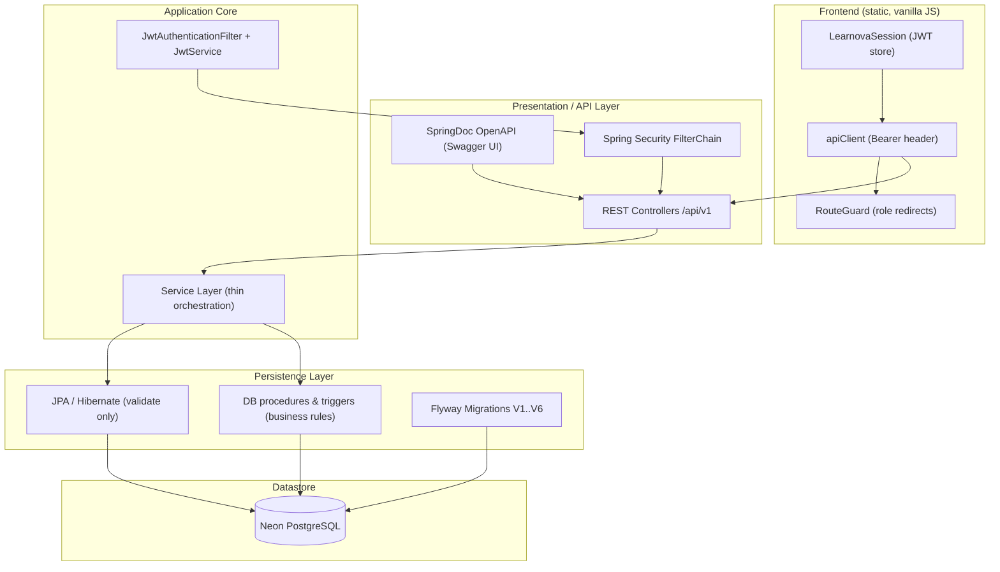
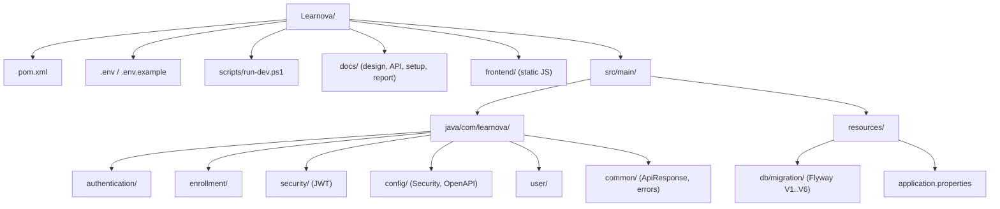
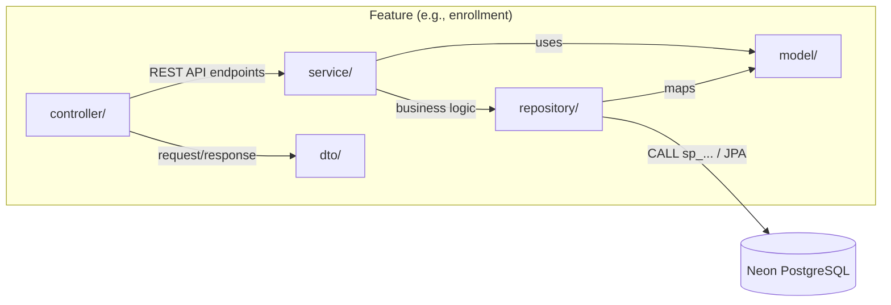
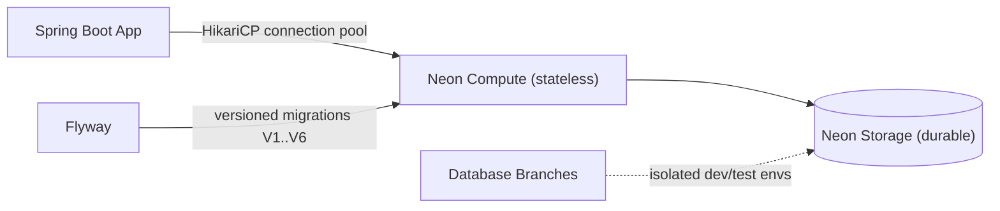
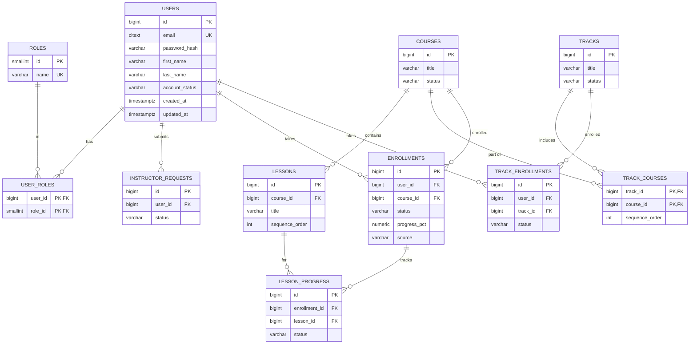
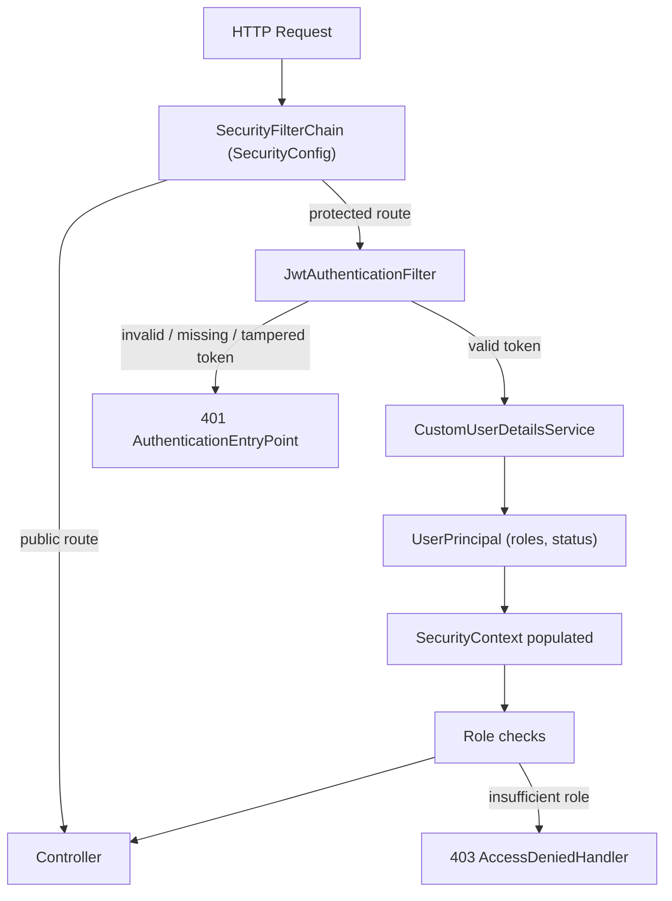
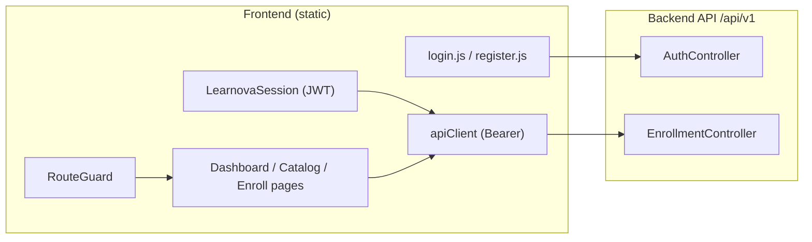
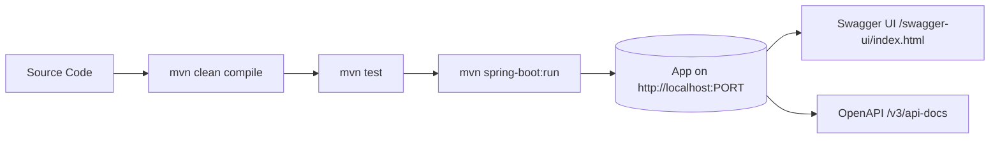
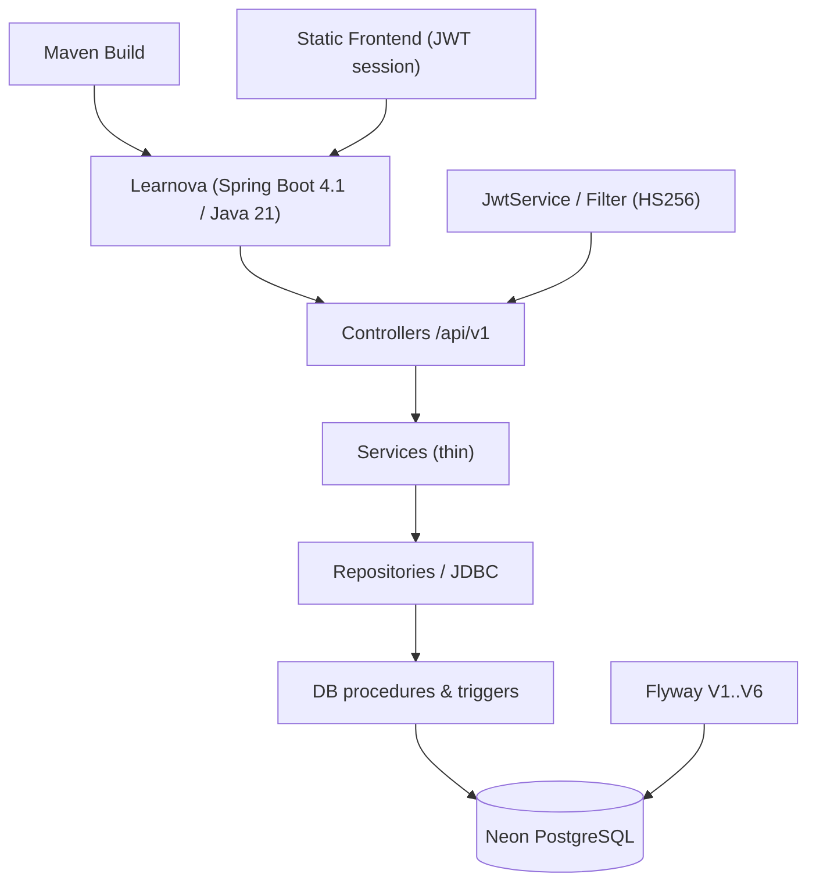

# System Architecture

Learnova is a **Java 21** Spring Boot application built with Maven, backed by a
serverless **Neon PostgreSQL** database, with a static (vanilla JS) frontend. The
system follows a layered design and — critically for this project — keeps the
**domain business rules in the database** (procedures, triggers, `LTxxx` error
codes) so the Java layer only orchestrates and forwards database decisions.

---

## 1. Technology Stack

- **Java 21** — LTS runtime declared by the project (`pom.xml`).
- **Spring Boot 4.1.x** — parent POM `spring-boot-starter-parent:4.1.0`.
- **Maven 3.9+** — build tooling (compile, package, `spring-boot:run`).
- **Spring Web MVC** — REST controllers (`spring-boot-starter-webmvc`).
- **Spring Data JPA / Hibernate** — persistence for the auth entities, with
  `ddl-auto=validate` (Hibernate never changes the schema).
- **Neon PostgreSQL** — serverless primary datastore.
- **Spring Security** — filter chain, stateless sessions, role-based authorization.
- **JWT (JSON Web Tokens)** — custom **HS256 (HMAC-SHA256)** implementation in
  `JwtService` (no third-party JWT library).
- **Flyway** — versioned migrations `V1`–`V6` are the single source of truth for the schema.
- **SpringDoc OpenAPI (Swagger UI)** — interactive API docs at `/swagger-ui/index.html`.



---

## 2. High-Level System Design

Three logical layers, plus a fourth that is owned by the database:

- **Presentation Layer (Controllers)** — `@RestController` entry points under
  `/api/v1`. They validate input, map DTOs, resolve the current user from the
  security context, and delegate to services. **No business logic.**
- **Business Layer (Services)** — `@Service` classes that orchestrate repository
  calls and, for enrollment, invoke the **stored procedures** in the database.
- **Data Access Layer (Repositories)** — Spring Data JPA interfaces plus the
  JDBC-based `EnrollmentCommandRepository` that calls `sp_enroll_student()` /
  `sp_enroll_track()` via `PreparedStatement`.
- **Database Logic Layer (Procedures & Triggers)** — enrollment, prerequisite,
  and progress rules live in PL/pgSQL. The Java layer forwards the database
  message verbatim (e.g. `LTN01: Student is already enrolled in course 2.`).

Request flow:

```mermaid
sequenceDiagram
    autonumber
    participant C as Client (frontend)
    participant F as JwtAuthenticationFilter
    participant Ctrl as Controller
    participant Svc as Service
    participant Repo as Repository
    participant DB as Neon PostgreSQL

    C->>F: HTTP Request (Bearer &lt;JWT&gt;)
    F->>F: Validate JWT, set SecurityContext
    F->>Ctrl: Authenticated principal
    Ctrl->>Ctrl: Validate input & map DTO
    Ctrl->>Svc: Delegate (thin logic)
    Svc->>Repo: CALL sp_enroll_student(...) / JPA query
    Repo->>DB: SQL / PL/pgSQL procedure
    DB-->>Repo: Result rows / LTxxx error
    Repo-->>Svc: Mapped result (or DB error)
    Svc-->>Ctrl: Response DTO
    Ctrl-->>C: ApiResponse JSON (or 400/401/403)
```

---

## 3. Directory Structure (Project Tree)

```
Learnova/
├── pom.xml
├── .env                      (local secrets — NEVER committed)
├── .env.example              (placeholders — committed)
├── scripts/
│   └── run-dev.ps1           (loads .env, runs mvn spring-boot:run)
├── database/                 (readable SQL design source of truth)
├── docs/
│   ├── ARCHITECTURE.md
│   ├── setup-guide.md
│   ├── api-endpoints.md
│   ├── final-report.md
│   └── database-design/      (auth, course, enrollment, prerequisite, progress, ...)
├── frontend/                 (static vanilla JS app, no build step)
└── src/
    └── main/
        ├── java/com/learnova/
        │   ├── authentication/   (AuthController, AuthService, DTOs)
        │   ├── enrollment/       (EnrollmentController, Service, Repositories, DTOs)
        │   ├── user/             (User, Role entities, UserProfileResponse)
        │   ├── security/         (JwtService, JwtAuthenticationFilter, UserPrincipal)
        │   ├── config/           (SecurityConfig, OpenApiConfig, AdminBootstrapRunner)
        │   ├── common/           (ApiResponse, GlobalExceptionHandler)
        │   └── course|prerequisite|progress|quiz|review|certificate|admin/  (placeholders)
        └── resources/
            ├── application.properties
            └── db/migration/     (Flyway V1..V6 — schema of record)
```



---

## 4. Module Breakdown

Learnova is a **single Maven module** with a **feature-based package layout**.
Each implemented feature follows the same convention:

```
feature/
├── controller/   REST endpoints + DTO mapping
├── service/      thin orchestration
├── repository/   Spring Data JPA / JDBC calls
├── dto/          request / response payloads
└── model/        JPA entities
```



### Where the rules actually live

- **Enrollment / prerequisite / progress rules** → database procedures and triggers
  (`sp_enroll_student`, `sp_enroll_track`, `fn_student_course_access`,
  `trg_auto_enroll_track`, progress triggers). The service forwards database errors
  (`LTU01/LTC01/LTT01/LTN01/LTN02/LTC02/LTP01/LT500`) verbatim.
- **Auth flows** → services (`AuthService`) with bcrypt password hashing and role
  assignment via `sp_manage_user_role`.
- **Controllers** → HTTP mapping, DTOs, `ApiResponse` envelope, status codes only.

---

## 5. Database Architecture (Neon PostgreSQL)

### Neon & Connection

Neon is a serverless PostgreSQL platform (separate compute/storage, branching).
All credentials come **only** from the environment (`.env`), never hardcoded:

```properties
spring.datasource.url=${DB_URL}
spring.datasource.username=${DB_USERNAME}
spring.datasource.password=${DB_PASSWORD}
spring.datasource.driver-class-name=org.postgresql.Driver
```



### Schema Management (Flyway)

- Migrations live in `src/main/resources/db/migration` and run automatically on boot.
- `ddl-auto=validate` — Hibernate verifies its entities match the Flyway schema but
  never alters it; `spring.flyway.clean-disabled=true` protects the Neon DB.

| Migration | Content |
|---|---|
| `V1__extensions_and_common_functions.sql` | `citext` extension, `set_updated_at()` helper |
| `V2__authentication_and_roles.sql` | `users`, `roles`, `user_roles` + trigger + seed roles |
| `V3__enrollment_module.sql` | Course contract, `enrollments`, `track_enrollments`, `lesson_progress`, procedures, triggers, seed data |
| `V4__auth_instructor_requests.sql` | `instructor_requests` + admin seed + `fn_admin_enrollment_stats()` |
| `V5__account_status_refinement.sql` | Statuses exactly `ACTIVE/SUSPENDED/BANNED` |
| `V6__fix_identity_sequences.sql` | Re-align identity sequences after explicit-ID seeds |

### Schema Structure (as implemented)



- **Auth** — `users`, `roles`, `user_roles`, `instructor_requests`.
- **Course contract** — `courses`, `lessons`, `tracks`, `track_courses`.
- **Enrollment** — `enrollments`, `track_enrollments`, `lesson_progress`.

> Tables from older design drafts that are **not** implemented yet (course categories,
> tags, quizzes, reviews, certificates, per-module progress) belong to future modules.

---

## 6. Security & Authentication Architecture

Stateless JWT authentication built on Spring Security, with a **custom HS256
implementation** (`JwtService`) — no third-party JWT library.

### How It Works

1. `POST /api/v1/auth/register` / `POST /api/v1/auth/login` are public; login
   returns a signed JWT plus `id`, `roles`, `primaryRole`, `status`, etc.
2. The client stores the token (frontend `LearnovaSession`) and sends it as
   `Authorization: Bearer <token>`.
3. `JwtAuthenticationFilter` (registered before `UsernamePasswordAuthenticationFilter`)
   validates the token and loads a `UserPrincipal` from `CustomUserDetailsService`.
4. Suspended/banned accounts are rejected at load time (403 at login, 401 on the filter).
5. Spring Security maps roles to `ROLE_STUDENT`/`ROLE_INSTRUCTOR`/`ROLE_ADMIN`.

```mermaid
sequenceDiagram
    autonumber
    participant Client
    participant FC as SecurityFilterChain
    participant JWT as JwtAuthenticationFilter
    participant Svc as AuthService
    participant DB as Neon PostgreSQL

    Note over Client,DB: Login (public route)
    Client->>FC: POST /api/v1/auth/login
    FC->>Svc: permitAll() route
    Svc->>DB: Verify bcrypt hash + account_status
    DB-->>Svc: User + roles
    Svc-->>Client: LoginResponse{token, id, roles, status} (200)

    Note over Client,DB: Authenticated request (protected route)
    Client->>FC: GET /api/v1/enrollments/my-courses (Bearer &lt;JWT&gt;)
    FC->>JWT: Intercept request
    JWT->>JWT: Verify HS256 signature + expiry
    JWT->>JWT: Load UserPrincipal (rejects suspended/banned)
    JWT-->>FC: Authenticated context
    FC->>Client: Allowed -> Controller (or 401 / 403)
```

### Security Pipeline



### Public vs. Protected Routes (real paths)

| Route | Access |
|---|---|
| `POST /api/v1/auth/register`, `POST /api/v1/auth/login` | Public |
| `/swagger-ui/**`, `/v3/api-docs/**`, `/actuator/health`, `/actuator/info` | Public |
| `GET /api/v1/auth/me` | Authenticated (any role) |
| `POST /api/v1/enrollments/courses/{id}`, `/tracks/{id}` | `ROLE_STUDENT` |
| `GET /api/v1/enrollments/my-courses`, `/my-tracks`, `/courses/{id}/access` | `ROLE_STUDENT` |
| `GET /api/v1/enrollments/stats` | `ROLE_ADMIN` |
| `POST/PUT/DELETE /api/v1/courses/**` | `ROLE_INSTRUCTOR` or `ROLE_ADMIN` (planned controllers) |
| `GET /api/v1/courses/**` | Public (planned controller) |

---

## 7. Frontend Architecture

The frontend is a **static vanilla-JS app** (`frontend/`) with no build step. It
communicates with the backend REST API over HTTP and mirrors the role/status rules.

- `js/utils/constants.js` — single source of truth: `API_BASE_URL`, roles, statuses,
  routes, grading/certificate rules.
- `js/api/apiClient.js` — base client that injects `Authorization: Bearer <token>`
  from the session on every request.
- `js/api/authApi.js`, `js/api/enrollmentApi.js` — typed wrappers over `/auth` and `/enrollments`.
- `js/auth/session.js` — persists the JWT + user profile (localStorage).
- `js/auth/routeGuard.js` — redirects unauthenticated/unauthorized users to `login.html`
  using role priority Admin > Instructor > Student.
- `js/components/navbar.js` — role-aware navigation tabs.



---

## 8. Build & Deployment Setup

### Maven Build Configuration

```xml
<parent>
    <groupId>org.springframework.boot</groupId>
    <artifactId>spring-boot-starter-parent</artifactId>
    <version>4.1.0</version>
    <relativePath/>
</parent>
<groupId>com.learnova</groupId>
<artifactId>learnova</artifactId>
<version>0.0.1-SNAPSHOT</version>
```

- Parent POM manages dependency versions (webmvc, data-jpa, security, validation,
  actuator, flyway + flyway-postgresql, springdoc-openapi, postgresql driver, jackson).
- JWT is implemented in-code (`JwtService`, HS256) — **no `jjwt` dependency**.
- Java toolchain targets **21** via `<java.version>21</java.version>`.

### Building & Running

```bash
mvn clean compile    # compile
mvn test             # tests
./scripts/run-dev.ps1   # loads .env then mvn spring-boot:run
```



### Configuration

- `server.port=${PORT:8000}` — port from env (`.env`), must match frontend `API_BASE_URL`.
- `spring.jpa.hibernate.ddl-auto=validate`, `spring.jpa.open-in-view=false`.
- `spring.flyway.clean-disabled=true`, `spring.flyway.locations=classpath:db/migration`.
- `app.jwt.secret=${JWT_SECRET}`, `app.jwt.expiration=${JWT_EXPIRATION_MS:86400000}`.
- Optional `app.bootstrap-admin.*` env-gated admin bootstrap (`AdminBootstrapRunner`).

---

## 9. Summary



Learnova combines a **layered Spring Boot design**, a **feature-based module layout**,
a **serverless Neon PostgreSQL database** whose procedures own the business rules, and
**stateless HS256 JWT authentication** consumed by a **static vanilla-JS frontend**.
