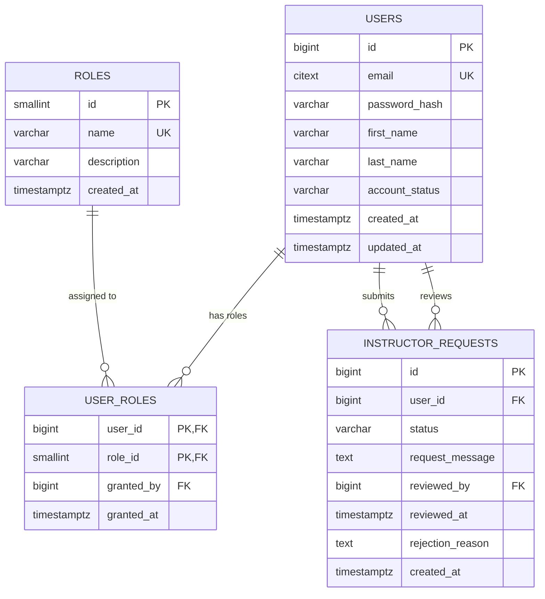
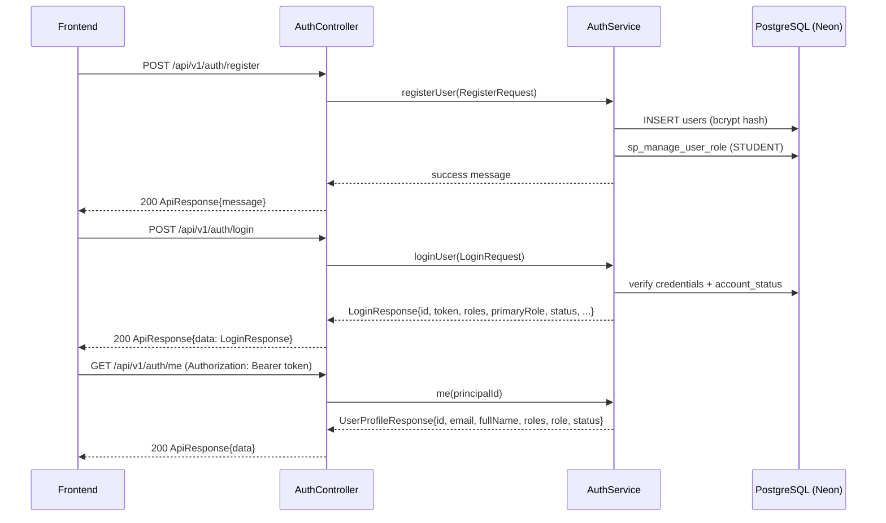

# Authentication Module — Database Architecture

Status: **Implemented** (migrations `V1`–`V2`; design file `database/auth.sql`).
Enforced by: `AuthService`, `JwtService`, `JwtAuthenticationFilter`, `SecurityConfig`.

## Tables

| Table | Purpose |
|---|---|
| `users` | Primary user accounts storing credentials and account status. |
| `roles` | Role lookup table: `STUDENT`, `INSTRUCTOR`, `ADMIN`. |
| `user_roles` | Junction table mapping users to their assigned roles (many-to-many). |
| `instructor_requests` | Student requests to become an instructor (`PENDING`/`APPROVED`/`REJECTED`). |

### `users`
- `email` is `citext` (case-insensitive), `UNIQUE`.
- `password_hash` stores a **bcrypt** hash (`$2b$...`).
- `account_status` — exactly one of `ACTIVE`, `SUSPENDED`, `BANNED` (enforced by
  `chk_users_account_status`).
- `created_at` / `updated_at` maintained automatically; `updated_at` is kept fresh by
  `trg_users_set_updated_at` (uses the `set_updated_at()` helper from `V1`).

### `roles`
- `name` is `UNIQUE` and `CHECK`-constrained to `STUDENT`, `INSTRUCTOR`, `ADMIN`.
- Seeded by `V2`.

### `user_roles`
- Composite primary key `(user_id, role_id)`.
- FKs: `user_id → users` (`CASCADE`), `role_id → roles` (`RESTRICT`), `granted_by → users` (`SET NULL`).

### `instructor_requests`
- FKs: `user_id → users` (`CASCADE`), `reviewed_by → users` (`SET NULL`).
- Status `CHECK` — `PENDING`, `APPROVED`, `REJECTED` (frontend stores these lowercase).
- Indexed on `(user_id, status)` and `(status, created_at)`.

## ER Diagram

## Triggers & Procedures

- `trg_users_set_updated_at` — `BEFORE UPDATE` on `users`, calls `set_updated_at()`.
- `sp_manage_user_role` — idempotent role assignment/revocation (module boundary used by services).

## Auth / JWT Flow

## Account Status Rules

- `ACTIVE` — can log in and use the platform.
- `SUSPENDED` — cannot log in (login returns `403 "This account is suspended..."`).
- `BANNED` — cannot log in (login returns `403 "This account is banned..."`).

## Seed Accounts (from migrations)

The bootstrap admin (`admin@learnova.com`) is provisioned from environment
variables (`BOOTSTRAP_ADMIN_PASSWORD`). The accounts below are seeded by the
V8 migration with password `password123`:

| Email | Roles | Status |
|---|---|---|
| `sultanakhadiza37@gmail.com` | Admin | active |
| `malihatasnim@gmail.com` | Student | active |
| `saikasarara@gmail.com` | Student | active |

> Role names in the DB are uppercase (`STUDENT`/`INSTRUCTOR`/`ADMIN`); the API maps
> them to the display roles `Student`/`Instructor`/`Admin` and to Spring authorities
> `ROLE_STUDENT`/`ROLE_INSTRUCTOR`/`ROLE_ADMIN`.
