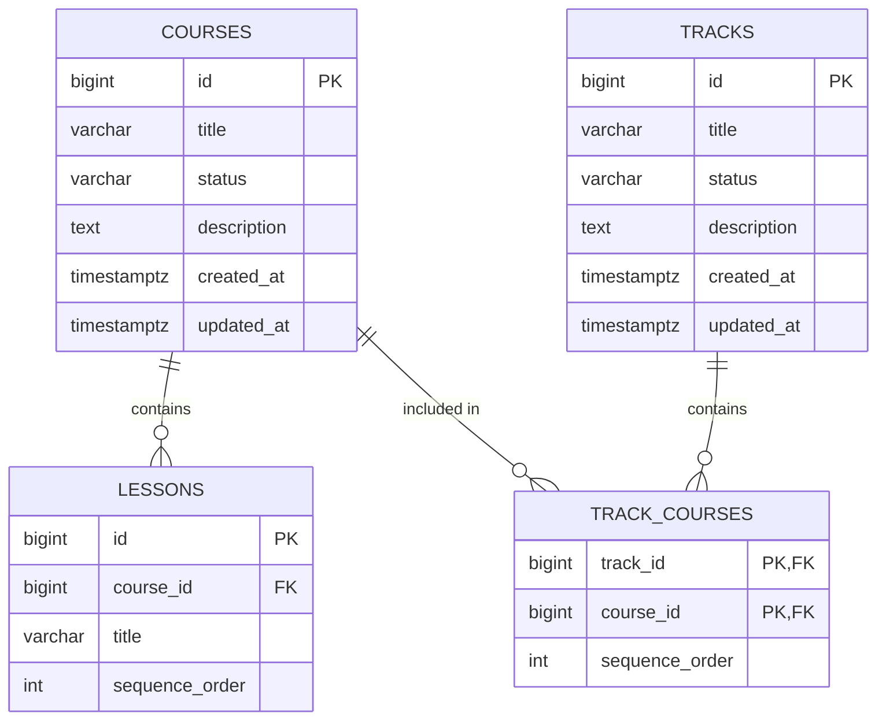
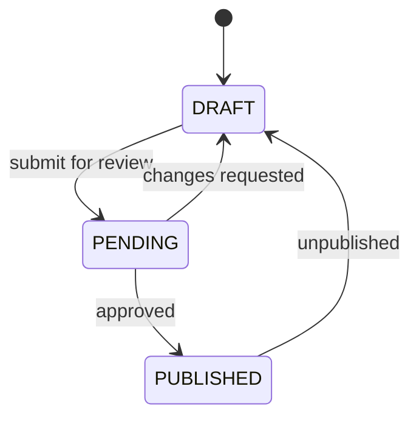

# Course Module — Database Architecture

Status: **Implemented** (the course contract exists via migration `V4`; design file
`database/courses.sql`). The cross-module course contract is the minimal set of tables
the enrolment procedures and triggers depend on. Full course CRUD controllers/services
are still placeholders (out of scope for this milestone).

## Tables (Course Contract, owned by V4)

| Table | Purpose |
|---|---|
| `courses` | Course catalog rows with lifecycle status. |
| `lessons` | Ordered lessons inside a course. |
| `tracks` | Named learning paths (e.g. "Database Engineer"). |
| `track_courses` | Ordered membership of courses in a track. |

### `courses`
- `status` — one of `DRAFT`, `PENDING`, `PUBLISHED` (`chk_courses_status`).
- `created_at` / `updated_at` timestamps.

### `lessons`
- FK `course_id → courses(id)` `ON DELETE CASCADE`.
- `UNIQUE (course_id, sequence_order)` — lessons are strictly ordered.

### `tracks`
- `status` — one of `DRAFT`, `PENDING`, `PUBLISHED` (`chk_tracks_status`).

### `track_courses`
- Composite PK `(track_id, course_id)`.
- FKs cascade on delete; `sequence_order` defines the order of a track.

## ER Diagram

## Course Lifecycle

Only `PUBLISHED` courses/tracks can be enrolled in (`sp_enroll_student` /
`sp_enroll_track` raise `LTC01`/`LTT01` otherwise).

## Seed Data (from V8, mirrors the frontend mock catalog)

- Courses: *Database Design Fundamentals*, *SQL & Query Optimization*,
  *Intro to Neo4j Graph Databases*, *Python for Data Science* (all `PUBLISHED`),
  *Modern React & TypeScript* (`PENDING`), *Data Warehousing & ETL* (`DRAFT`).
- Lessons: 4 lessons per seeded course, `sequence_order` 1–4.
- Track: *Database Engineer* (`PUBLISHED`) containing courses 1 → 2 → 3.
