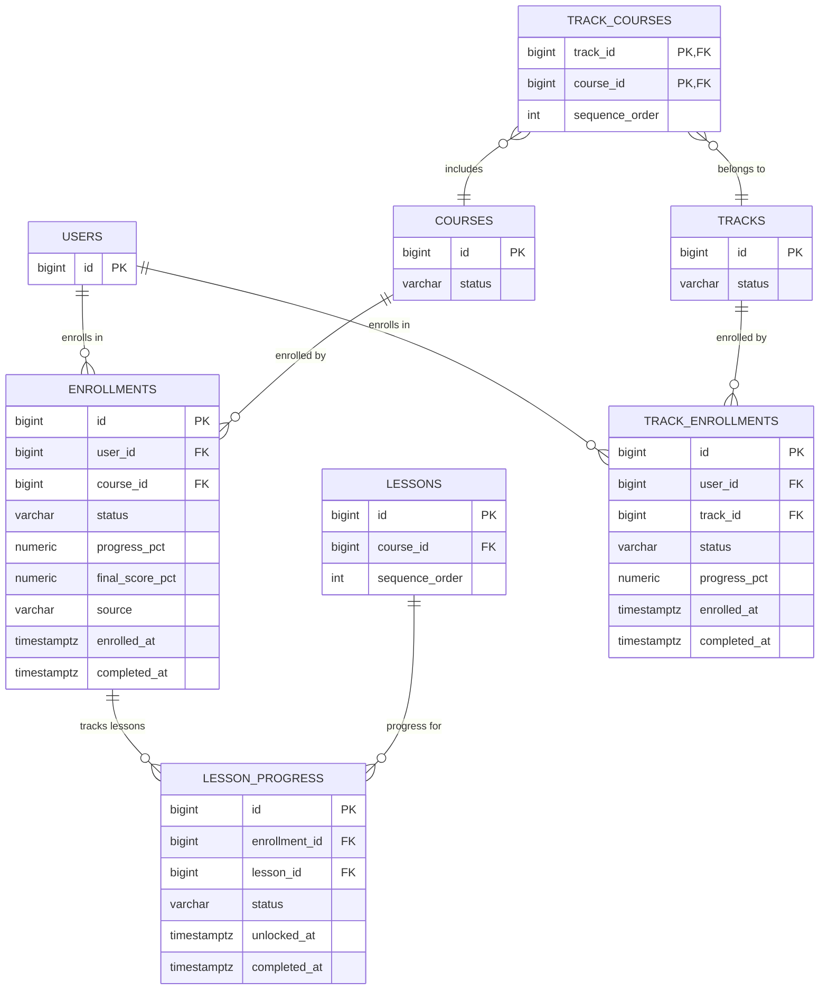
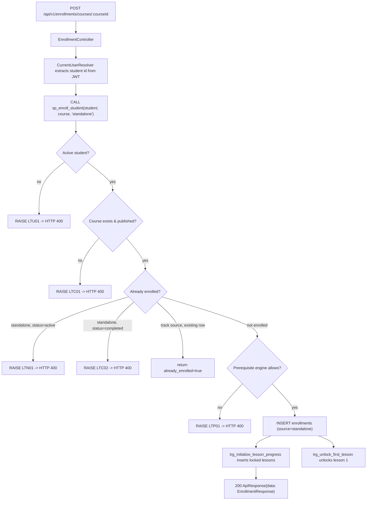

# Enrollment Module — Database Architecture

Status: **Implemented** (migration `V6`; design file `database/enrollment.sql`).
Owned by: `EnrollmentController`, `EnrollmentService`, `EnrollmentRepository`,
`EnrollmentCommandRepository`. All business rules and exception codes live in the
database; the Java layer only forwards the database message verbatim.

## Tables

| Table | Purpose |
|---|---|
| `enrollments` | One row per (student, course) enrollment. |
| `track_enrollments` | One row per (student, track) enrollment. |
| `lesson_progress` | Per-lesson state for each course enrollment. |

### `enrollments`
- `UNIQUE (user_id, course_id)` — a student can enroll in a course once.
- `status` — `active` or `completed` (`chk_enrollments_status`).
- `source` — `standalone` or `track` (`chk_enrollments_source`); track-source rows are
  created by the auto-enroll trigger and cannot be duplicated by a standalone enroll.
- `progress_pct` — `NUMERIC(5,2)` in `[0, 100]` (`chk_enrollments_progress_range`).
- `final_score_pct`, `completed_at` filled when the course is completed.

### `track_enrollments`
- `UNIQUE (user_id, track_id)`; same status/progress rules as `enrollments`.

### `lesson_progress`
- `UNIQUE (enrollment_id, lesson_id)`; FKs cascade on delete.
- `status` — `locked`, `unlocked`, or `completed` (`chk_lesson_progress_status`).
- Rows are auto-created (`locked`) when a course enrollment is inserted.

## ER Diagram

## Functions & Procedures

| Object | Purpose |
|---|---|
| `fn_user_is_active_student(id)` | True when the user is `ACTIVE` **and** holds the `STUDENT` role. |
| `sp_enroll_student(student, course, source)` | Core enrollment procedure (returns enrollment row + `already_enrolled` flag). |
| `sp_enroll_track(student, track)` | Track enrollment procedure. |
| `trg_auto_enroll_track` | After a track enroll, auto-enrolls every `PUBLISHED` course in the track with `source = 'track'`. |
| `fn_student_course_access(student, course)` | Access decision used by `GET /enrollments/courses/{id}/access`. |
| `fn_course_first_lesson_id(course)` | First lesson id by `sequence_order`. |
| `fn_prerequisite_engine_course_access(student, course)` | **External contract** (see `prerequisite.md`) — currently a placeholder returning "allowed". |

## Enrollment Flow

## Domain Error Codes

| Code | Meaning | HTTP |
|---|---|---|
| `LTU01` | Only active students can enroll. | 400 |
| `LTC01` | Course/track does not exist or is not published. | 400 |
| `LTT01` | Track does not exist or is not published. | 400 |
| `LTN01` | Already enrolled (active) in the course. | 400 |
| `LTN02` | Already enrolled in the track. | 400 |
| `LTC02` | Course already completed and cannot be re-enrolled. | 400 |
| `LTP01` | Prerequisites not satisfied (delegated to prerequisite engine). | 400 |
| `LT500` | Unexpected database error (logged; generic message to client). | 400 |

## Indexes

- `idx_enrollments_user_status` on `enrollments(user_id, status)`
- `idx_lesson_progress_enrollment_status` on `lesson_progress(enrollment_id, status)`
- `idx_track_enrollments_user_status` on `track_enrollments(user_id, status)`

## Trigger Summary

| Trigger | Fires | Effect |
|---|---|---|
| `trg_initialize_lesson_progress` | `AFTER INSERT` on `enrollments` | Creates a `locked` `lesson_progress` row per lesson. |
| `trg_unlock_first_lesson` | `AFTER INSERT` on `enrollments` | Unlocks the first lesson (if the prerequisite engine allows). |
| `trg_auto_enroll_track` | `AFTER INSERT` on `track_enrollments` | Auto-enrolls published track courses. |
| `trg_prevent_duplicate_enrollment` | `BEFORE INSERT` on `enrollments` | Raises `LTN01` on a duplicate active enrollment. |
| `trg_update_course_progress` | `AFTER INSERT/UPDATE/DELETE` on `lesson_progress` | Recomputes course progress; completes at 100%. |
| `trg_update_track_progress` | `AFTER INSERT/UPDATE` on `enrollments` | Recomputes track progress; completes at 100%. |
| `trg_unlock_track_courses_after_completion` | `AFTER UPDATE OF status` on `enrollments` | Unlocks first lessons of affected track courses after a course completes. |
