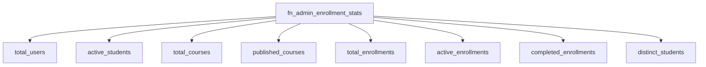

# Indexes & Views — Database Architecture

Status: **Indexes and views implemented across `V1`–`V14`** (see `database/*.sql`).

## Notable Indexes

| Index | Table | Columns | Migration |
|---|---|---|---|
| `uq_users_email` | `users` | `email` (unique, citext) | V2 |
| `uq_roles_name` | `roles` | `name` (unique) | V2 |
| `uq_categories_normalized_name` | `categories` | `lower(btrim(name))` (unique) | V3 |
| `idx_courses_status` | `courses` | `status` | V4 |
| `idx_courses_category_status` | `courses` | `(category_id, status)` | V4 |
| `idx_courses_instructor_status` | `courses` | `(instructor_id, status)` | V4 |
| `idx_courses_title_trgm` | `courses` | `title` GIN (pg_trgm) | V4 |
| `idx_courses_pending_review` | `courses` | `(status, submitted_at DESC)` partial | V4 |
| `idx_courses_search_vector` | `courses` | `search_vector` GIN (full-text) | V5 |
| `idx_courses_public_catalogue` | `courses` | `(status, category_id, difficulty, published_at)` | V5 |
| `idx_courses_rating` | `courses` | `(avg_rating DESC, review_count DESC)` | V5 |
| `uq_enrollments_user_course` | `enrollments` | `(user_id, course_id)` (unique) | V6 |
| `idx_enrollments_user_status` | `enrollments` | `(user_id, status)` | V6 |
| `uq_track_enrollments_user_track` | `track_enrollments` | `(user_id, track_id)` (unique) | V6 |
| `idx_track_enrollments_user_status` | `track_enrollments` | `(user_id, status)` | V6 |
| `idx_lesson_progress_enrollment_status` | `lesson_progress` | `(enrollment_id, status)` | V7 |
| `idx_course_prerequisites_course` | `course_prerequisites` | `course_id` | V9 |
| `idx_course_prerequisites_prerequisite` | `course_prerequisites` | `prerequisite_course_id` | V9 |
| `idx_course_bypasses_user` | `course_bypasses` | `user_id` | V9 |
| `idx_quiz_submissions_user_quiz` | `quiz_submissions` | `(user_id, quiz_id)` | V10 |
| `idx_reviews_course_rating` | `reviews` | `(course_id, rating)` | V11 |
| `idx_certificates_user_issued` | `certificates` | `(user_id, issued_at DESC)` | V12 |
| `idx_notifications_user_created` | `notifications` | `(user_id, created_at DESC)` | V13 |
| `idx_audit_logs_table_record` | `audit_logs` | `(table_name, record_id)` | V14 |
| `idx_audit_logs_performed_at` | `audit_logs` | `performed_at DESC` | V14 |

## Reporting Function

`fn_admin_enrollment_stats()` returns fresh platform counters (used by
`GET /api/v1/enrollments/stats`):

## Views (as implemented)

- `vw_public_course_cards` (V5) — published course cards for the anonymous catalogue.
- `vw_course_prerequisite_closure` (V9) — recursive-CTE transitive prerequisite closure
  with depth.
- `vw_quiz_public` (V10) — sanitized quiz questions/options (correctness flags hidden).
