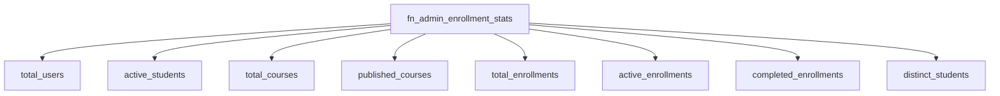

# Indexes & Views — Database Architecture

Status: **Indexes implemented** (migrations `V2`–`V4`); **no views exist yet**.

## Indexes

| Index | Table | Columns | Migration |
|---|---|---|---|
| `uq_users_email` | `users` | `email` (unique) | V2 |
| `uq_roles_name` | `roles` | `name` (unique) | V2 |
| `uq_enrollments_user_course` | `enrollments` | `(user_id, course_id)` (unique) | V3 |
| `idx_enrollments_user_status` | `enrollments` | `(user_id, status)` | V3 |
| `uq_track_enrollments_user_track` | `track_enrollments` | `(user_id, track_id)` (unique) | V3 |
| `idx_track_enrollments_user_status` | `track_enrollments` | `(user_id, status)` | V3 |
| `uq_lesson_progress_enrollment_lesson` | `lesson_progress` | `(enrollment_id, lesson_id)` (unique) | V3 |
| `idx_lesson_progress_enrollment_status` | `lesson_progress` | `(enrollment_id, status)` | V3 |
| `uq_lessons_course_sequence` | `lessons` | `(course_id, sequence_order)` (unique) | V3 |
| `pk_track_courses` | `track_courses` | `(track_id, course_id)` (unique) | V3 |
| `idx_instructor_requests_user_status` | `instructor_requests` | `(user_id, status)` | V4 |
| `idx_instructor_requests_status_created` | `instructor_requests` | `(status, created_at)` | V4 |

## Reporting Function

`fn_admin_enrollment_stats()` returns fresh platform counters (used by
`GET /api/v1/enrollments/stats`):

## Planned Views (not yet implemented)

- `vw_course_prerequisite_closure` — recursive-CTE closure over the future
  `course_prerequisites` table (owned by the prerequisite module; `V3` explicitly
  leaves it for that module).
- Course/quizzes/review/certificate views arrive with their modules.
