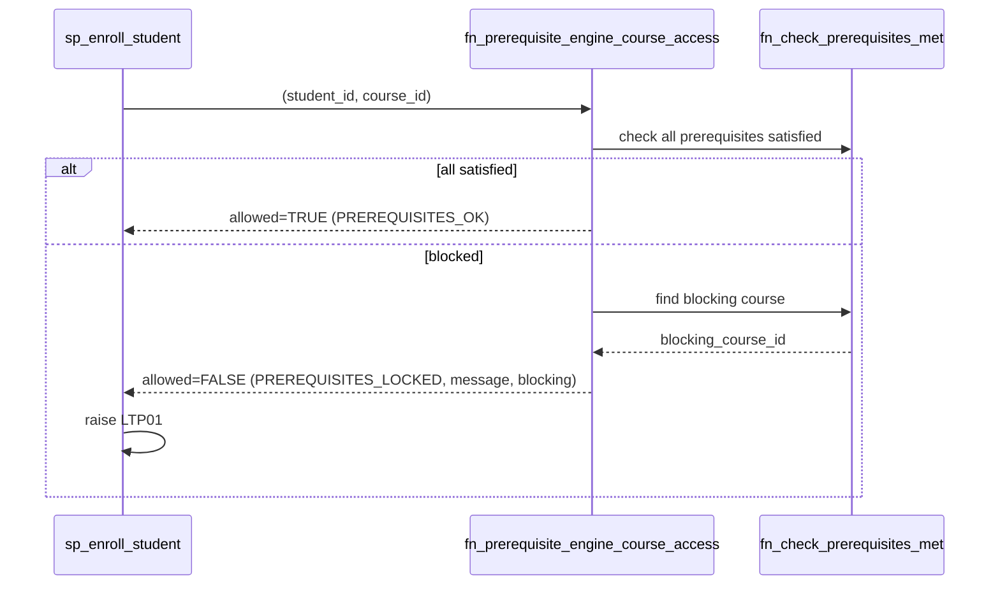
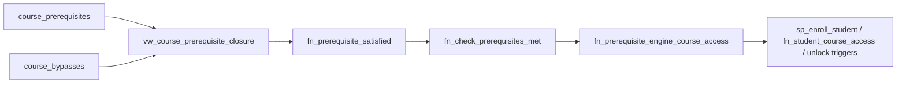

# Prerequisite Module — Database Architecture

Status: **Implemented** (migration `V9__prerequisite.sql`; design file
`database/prerequisite.sql`).

Enrollment does **not** own the prerequisite graph. It depends exclusively on the
function contract `fn_prerequisite_engine_course_access(...)`. `V6` shipped a
placeholder body that returned `allowed = TRUE`; `V9` replaced **only the body** (never
the signature) with the real engine, so enrollment, progress and catalogue started
enforcing prerequisites without any changes to their code.

## Contract

```sql
CREATE OR REPLACE FUNCTION public.fn_prerequisite_engine_course_access(
    p_student_id BIGINT,
    p_course_id  BIGINT
)
RETURNS TABLE (
    allowed            BOOLEAN,
    reason_code        TEXT,
    message            TEXT,
    blocking_course_id BIGINT
);
```

Consumers:

- `sp_enroll_student` (standalone enrolls) — raises `LTP01` when `allowed = FALSE`.
- `fn_student_course_access` — returns `prerequisites_locked` + the blocking course
  when `allowed = FALSE`.
- `trg_unlock_first_lesson`, `trg_unlock_track_courses_after_completion`,
  `trg_unlock_course_after_bypass` — gate lesson unlocks on `allowed`.

## Engine Behavior (V9)



## Objects (V9)

| Object | Purpose |
|---|---|
| `course_prerequisites` | Directed edges `(course_id, prerequisite_course_id, required_min_score)`; self-reference and cycles rejected by `trg_prevent_circular_prerequisite`. |
| `course_bypasses` | Per-student bypass `(user, target, prerequisite)` rows that satisfy the prerequisite early. |
| `vw_course_prerequisite_closure` | Recursive-CTE view of the transitive prerequisite closure with depth. |
| `fn_prerequisite_satisfied` | TRUE when the prerequisite course is completed or bypassed. |
| `fn_check_prerequisites_met` | AND-rule over all prerequisites of a course. |
| `fn_find_blocking_course` | First unsatisfied prerequisite (for display). |
| `sp_assign_course_prerequisite` / `sp_remove_course_prerequisite` | Management procedures (course owner or admin). |
| `trg_unlock_course_after_bypass` | Unlocks the first lesson of active enrollments whose prerequisites are now met. |



## Seed Note

The demo dependency chain (course 2 → course 1, course 3 → course 2) is applied by
`V9`, mirroring the Database Engineer track.
