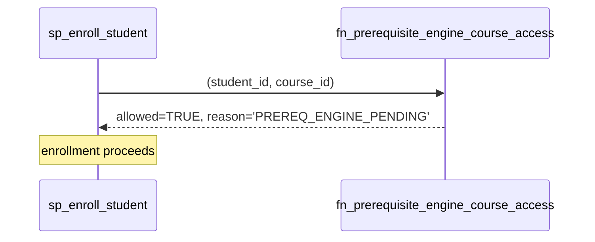
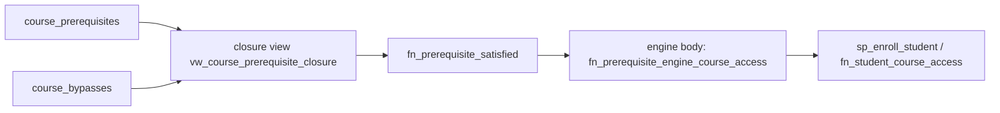

# Prerequisite Module — Database Architecture

Status: **Contract only — engine not connected yet.**

Enrollment does **not** own the prerequisite graph. It depends exclusively on the
function contract `fn_prerequisite_engine_course_access(...)`. The migration `V3`
ships a placeholder body that returns `allowed = TRUE` so enrollment keeps working;
the prerequisite module must replace only the body (never the signature).

## Contract

```sql
CREATE OR REPLACE FUNCTION public.fn_prerequisite_engine_course_access(
    p_student_id BIGINT,
    p_course_id  BIGINT
)
RETURNS TABLE (
    allowed            BOOLEAN,
    reason_code        TEXT,
    message            TEXT,
    blocking_course_id BIGINT
);
```

Consumers today:

- `sp_enroll_student` (standalone enrolls) — raises `LTP01` when `allowed = FALSE`.
- `fn_student_course_access` — returns `prerequisites_locked` + the blocking course
  when `allowed = FALSE`.
- `trg_unlock_first_lesson`, `trg_unlock_track_courses_after_completion` — gate
  lesson unlocks on `allowed`.

## Current Placeholder Behavior



## Planned (owned by the prerequisite module, NOT yet implemented)

| Object | Plan |
|---|---|
| `course_prerequisites` | Directed prerequisite edges `(course_id, prerequisite_course_id)` with `status` (`MET`/`NOT_MET`). |
| `course_bypasses` | Per-student bypass rows that unlock a course early. |
| `vw_course_prerequisite_closure` | Recursive-CTE view computing the transitive prerequisite closure. |
| `fn_prerequisite_satisfied` / `fn_check_prerequisites_met` / `fn_find_blocking_course` | Decision helpers the engine body will use. |
| `trg_unlock_course_after_bypass` | Reacts to `course_bypasses` inserts (V3 leaves a `NOT` placeholder note for it). |



## Seed Note

The demo prerequisite seed row ("course 2 requires course 1") belongs to this module
and will be applied by its migration, not by `V3`.
