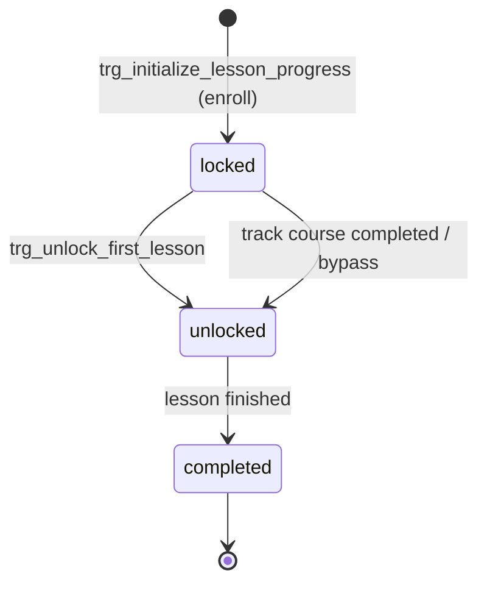
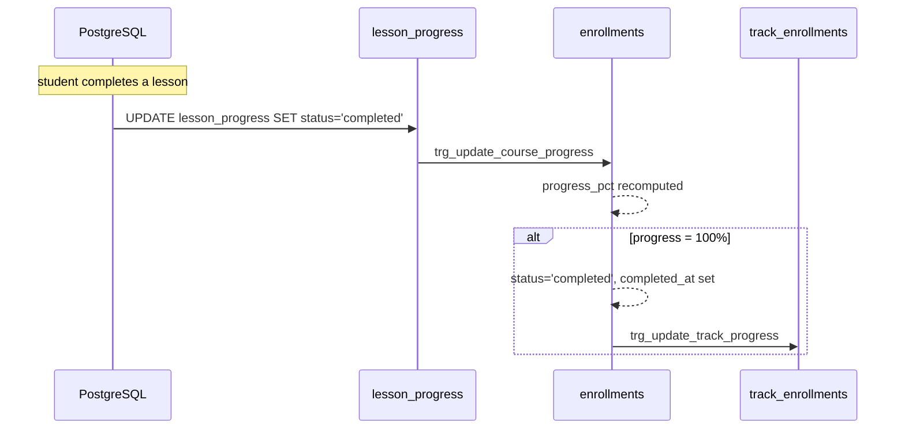

# Progress Module — Database Architecture

Status: **Implemented** (migration `V3`).
Progress is computed entirely in the database from `lesson_progress` rows; there is
no Java progress service yet.

## Model

Progress is derived, never stored manually:

- **Course progress** — `enrollments.progress_pct` = completed lessons ÷ total
  lessons × 100, computed by `fn_calculate_course_progress(enrollment_id)`.
- **Track progress** — `track_enrollments.progress_pct` = average `progress_pct`
  across the track's courses, computed by `fn_calculate_track_progress(student, track)`.
- A course/track is auto-completed when progress reaches **100%** (`completed_at` set).

## Lesson Lifecycle

## Functions & Triggers

| Object | Effect |
|---|---|
| `fn_calculate_course_progress(enrollment_id)` | Ratio of completed to total lessons. |
| `fn_calculate_track_progress(student_id, track_id)` | Mean course progress in the track. |
| `trg_update_course_progress` | After any `lesson_progress` change, recomputes the course `progress_pct`; sets `status = 'completed'` at 100%. |
| `trg_update_track_progress` | After enrollment insert/update, recomputes track progress; completes at 100%. |
| `trg_unlock_track_courses_after_completion` | When a course completes, unlocks the first lesson of the other courses that the prerequisite engine now allows. |

## Lifecycle Diagram

