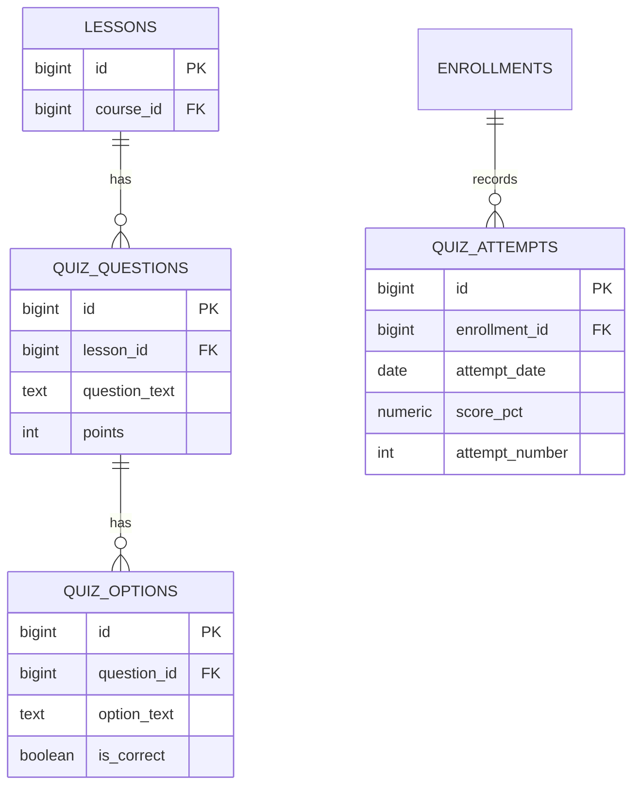

# Quiz Module — Database Architecture

Status: **Not implemented.** No quiz tables, functions, triggers, or migrations exist yet.

## Product Rules (spec, for the future module)

- Instructors bank **20 MCQs per lesson**; students see **5 random** questions per attempt
  (`frontend/js/utils/constants.js` → `QUIZ_DEFAULTS`).
- Passing score is **60%**; a student gets **3 attempts per day**, reset at midnight
  (`GRADING`).
- Grades are recorded per enrollment so progress/certificates can consume them.

## Planned ER Diagram (design intent)

## Implementation Plan (future migration)

1. `quiz_questions`, `quiz_options` (20 questions per lesson, options with one correct).
2. `quiz_attempts` with daily-attempt and passing-score enforcement in a stored procedure.
3. Procedure raises `LTQxxx`-style codes mirroring the enrollment module pattern.
4. Seed question banks for the demo lessons.
