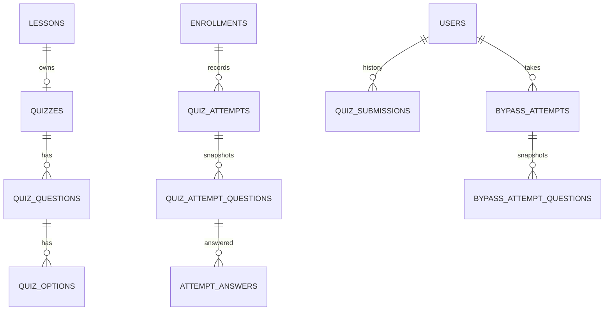

# Quiz Module — Database Architecture

Status: **Implemented** (migration `V10__quiz.sql`; design file `database/quiz.sql`).

## Product Rules

- A quiz hangs off a lesson (`quizzes.lesson_id`, one per lesson).
- Passing score is **60%** by default (per-quiz `passing_score`); a student gets
  `daily_attempt_limit` attempts per day, reset at midnight.
- Each attempt draws `questions_per_attempt` **random** questions from the lesson's
  bank (`fn_quiz_pick_questions`).
- Grades are recorded per enrollment (`enrollments.final_score_pct` keeps the best
  score) so progress/certificates can consume them.
- A **bypass attempt** lets a student pass a quiz of a *prerequisite* course to
  satisfy that prerequisite without completing it (`sp_start_bypass_attempt`,
  `sp_submit_quiz_attempt`); passing inserts a `course_bypasses` row that the
  prerequisite engine (V9) honours.

## ER Diagram (as implemented)

## Tables (V10)

- `quizzes` — per-lesson quiz config (passing score, questions per attempt, daily limit).
- `quiz_questions`, `quiz_options` — question bank; exactly one correct option per question.
- `quiz_attempts` + `quiz_attempt_questions` — per-enrollment attempt and its drawn question snapshot.
- `attempt_answers` — selected option per snapshot question (`is_correct` resolved at insert).
- `quiz_submissions` — graded history per user/quiz.
- `bypass_attempts`, `bypass_attempt_questions`, `bypass_attempt_answers` — bypass quiz lifecycle.

## Flow

- `sp_start_quiz_attempt(enrollment, quiz)` — enforces daily limit, draws the snapshot.
- `sp_answer_quiz_question(attempt, question, option, bypass)` — records the answer.
- `sp_submit_quiz_attempt(attempt, bypass)` — grades, writes submissions/history, updates
  `enrollments.final_score_pct`, and (for bypasses) inserts `course_bypasses`.
- Errors use `LTQxx` codes (`LTQ01` missing attempt, `LTQ03` missing quiz, `LTQ04`
  daily limit, `LTQ05` already submitted, `LTQ06` no answers, `LTQ07` bad option).

## Seed

Three demo quizzes are seeded for lessons 1 and 2 (course 1) and lesson 5 (course 2),
nine questions with four options each, and identity sequences re-aligned.
