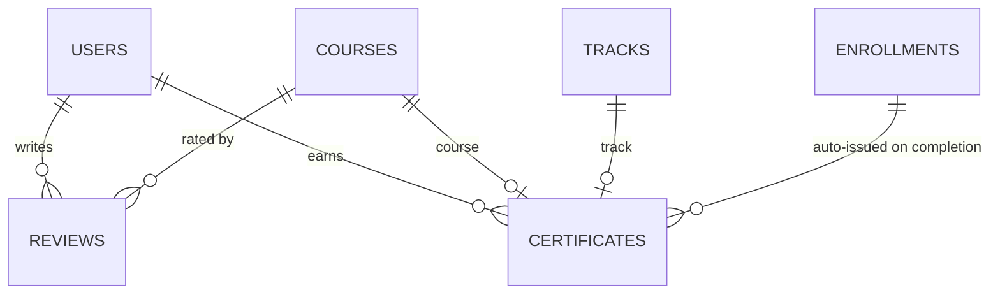

# Review & Certificate Module — Database Architecture

Status: **Implemented** (migrations `V11__review.sql` + `V12__certificate.sql`;
design files `database/review.sql` + `database/certificate.sql`).

## Product Rules

- **Review**: students can review courses they are enrolled in (active or completed),
  one review per student/course (`UNIQUE (user_id, course_id)`), rating 1–5.
  Ratings feed the denormalized `courses.avg_rating` / `courses.review_count` counters
  that the catalogue reads directly.
- **Certificate**: issued when a course or track is completed; unique `LT-XXXX…` code
  (14-char uppercase hex after the `LT-` prefix).

## ER Diagram (as implemented)

## Review (V11)

- `reviews` — `rating SMALLINT CHECK (1..5)`, `comment`, `UNIQUE (user_id, course_id)`.
- `trg_update_course_rating` — `AFTER INSERT OR UPDATE OR DELETE` recalculates
  `courses.avg_rating` + `courses.review_count`.
- `sp_upsert_review(student, course, rating, comment)` — validates the course is
  published and the student is enrolled; upserts. Errors: `LTR01`–`LTR03`.

## Certificate (V12)

- `certificates` — `type` (`course`/`track`), exactly one of `course_id`/`track_id`
  (CHECK), unique `cert_code`, uniqueness on `(user_id, course|track)` via
  `uq_certificates_user_entity`.
- `sp_issue_certificate(student, type, entity)` — **idempotent**: returns the existing
  certificate instead of raising; validates the corresponding completion record.
- `trg_auto_issue_certificate` — fires when an enrollment transitions to `completed`.
- `fn_certificate_verify(code)` — public lookup for the verification page.
- `trg_notify_certificate_issued` (V13) notifies the holder.
