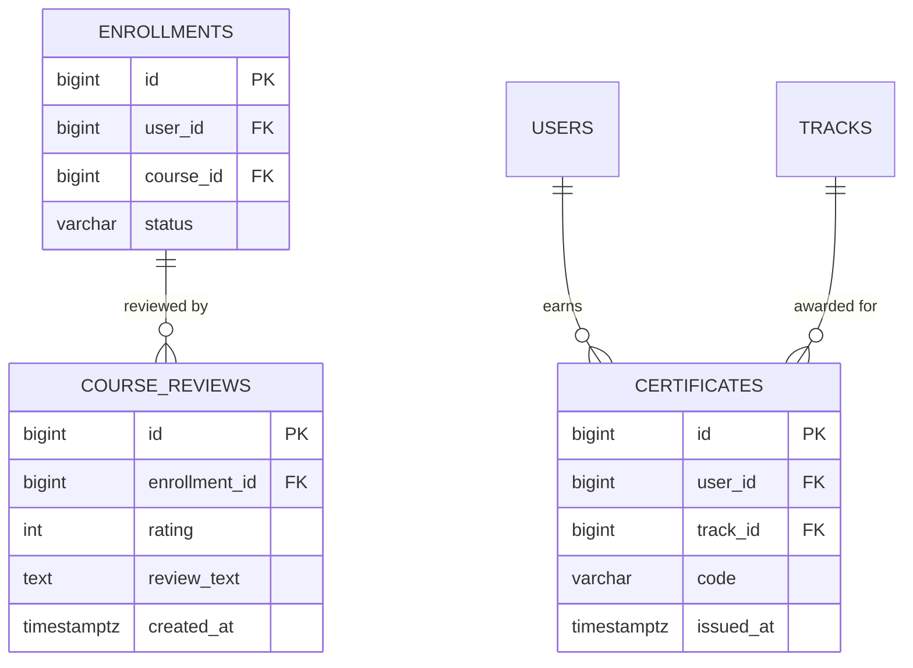

# Review & Certificate Module — Database Architecture

Status: **Not implemented.** No tables, functions, triggers, or migrations exist yet.

## Product Rules (spec, for the future module)

- **Review**: students can review courses they completed; ratings feed platform reporting.
- **Certificate**: awarded when a track is completed; unique code format `LRV-XXXX-XXXX`
  (`frontend/js/utils/constants.js` → `CERTIFICATE`).

## Planned ER Diagram (design intent)

## Implementation Plan (future migration)

1. `course_reviews` — one review per completed enrollment (`UNIQUE (enrollment_id)`),
   rating CHECK 1–5.
2. `certificates` — one per completed track per user; `code` `UNIQUE` with the `LRV-XXXX-XXXX` format.
3. Issuance gated on `track_enrollments.status = 'completed'` (trigger or procedure).
