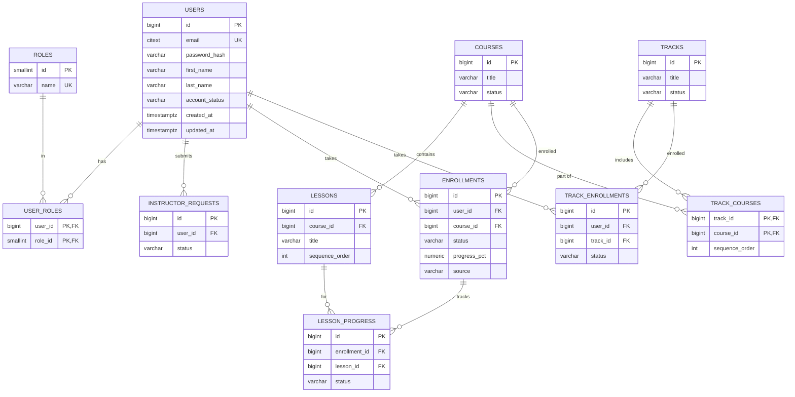

# Learnova Development Setup Guide

Welcome to **Learnova**! This guide helps every team member set up their local
development environment and **follow the implemented database design** before
contributing.

---

# Tech Stack

| Component | Technology |
|------------|------------|
| Language | Java 21 |
| Framework | Spring Boot 4.1.x |
| Build Tool | Maven 3.9+ |
| Database | PostgreSQL (hosted on Neon) |
| Migration Tool | Flyway |
| Authentication | Spring Security + JWT (custom HS256) |
| API Documentation | SpringDoc OpenAPI |
| IDE | Visual Studio Code |
| Version Control | Git + GitHub |

---

# Documentation Index

Read these before changing anything — the schema is **owned by Flyway migrations**,
and the docs below describe exactly what is implemented.

| Document | Covers |
|---|---|
| `database/README.md` | Feature file index — one SQL file per feature, mirrors the migrations |
| `database/auth.sql` | `users`, `roles`, `user_roles`, `instructor_requests` (deployed by `V2`) |
| `database/courses.sql` / `catalogue.sql` | Course contract + public catalogue (deployed by `V4`/`V5`) |
| `database/enrollment.sql` / `progress.sql` | Enrollments, tracks, lesson progress (deployed by `V6`/`V7`) |
| `database/prerequisite.sql` | Prerequisite engine + bypasses (deployed by `V9`) |
| `database/quiz.sql` | Quiz engine + bypass quizzes (deployed by `V10`) |
| `database/review.sql` | Reviews + rating aggregation (deployed by `V11`) |
| `database/certificate.sql` | Certificates + auto-issue (deployed by `V12`) |
| `database/notification.sql` | Notifications (deployed by `V13`) |
| `database/audit.sql` | Audit logging (deployed by `V14`) |
| `docs/database-design/*.md` | Per-feature design notes (auth, course, prerequisite, quiz, ...) |
| `docs/api-endpoints.md` | Every implemented REST endpoint: auth, roles, payloads, error codes |
| `docs/final-report.md` | Milestone verification report (14 sections) |
| `docs/er-diagram.png` | Overall entity-relationship overview |

---

# Database Overview (as implemented)

The implemented schema spans **18 Flyway migrations** (`V1`–`V18`): extensions, auth,
categories, course management, public catalogue, enrollment, progress, demo seed data,
prerequisite engine, quiz engine, reviews, certificates, notifications, audit,
certificate uniqueness hardening, audit-trigger fix for composite-PK tables,
instructor seed accounts, and curriculum replace authoring.



Key rules enforced in the database (see `enrollment.md`):

- `enrollments` is `UNIQUE (user_id, course_id)`; status `active`/`completed`.
- `track_courses` orders courses inside a track.
- `lesson_progress` rows are created `locked` on enrollment and unlocked by triggers.
- Business logic lives in procedures/triggers; the API just forwards `LTxxx` codes.

---

# Prerequisites

## Required Software

- Git
- Java JDK 21
- Apache Maven 3.9+
- Visual Studio Code

> PostgreSQL 18 is **not** required locally — the shared database is hosted on
> **Neon** and reached over the network.

---

# VS Code Extensions

### Java Extension Pack (Microsoft)

- Language Support for Java™ by Red Hat
- Maven for Java
- Debugger for Java
- Test Runner for Java
- Project Manager for Java

### Spring Boot Extension Pack (VMware)

- Spring Boot Dashboard
- Spring Boot Tools
- Spring Initializr Support

### PostgreSQL

Recommended for viewing/querying the Neon database (or use `psql` / `dbeaver`).

### GitLens

Recommended for Git history and code review.

### Markdown Preview Mermaid Support

**Required** to render the `mermaid` diagrams in the docs above.

---

# Clone the Repository

```bash
git clone <repository-url>
cd Learnova
```

Open the project:

```bash
code .
```

> **Important:** Open the **Learnova** project root, **not** the `src` folder.

Correct:

```
Learnova/
│── pom.xml
│── src/
│── database/
│── frontend/
│── docs/
```

---

# Verify Java Installation

```bash
java -version    # Java 21
javac -version   # Java 21
mvn -version     # Apache Maven 3.9+, Java 21
```

---

# Verify Maven Build

```bash
mvn clean compile
```

Expected: `BUILD SUCCESS`. If the build fails, resolve it before continuing.

---

# Neon Database

The shared development/production database is hosted on **Neon** (PostgreSQL).
Only the database maintainer creates/modifies the database. Everyone else only needs
the connection credentials.

The schema is **created and managed entirely by Flyway** on application startup —
see [Flyway](#flyway).

---

# Environment Variables

Create a local `.env` by copying the template:

```bash
Copy-Item .env.example .env   # PowerShell
# cp .env.example .env        # macOS/Linux
```

Fill in your real Neon and JWT values.

```env
# Spring profile (dev loads application-dev.properties on top of the base)
SPRING_PROFILES_ACTIVE=dev

# Neon PostgreSQL connection
DB_URL=jdbc:postgresql://HOST-POOL.REGION.aws.neon.tech/learnova_db?sslmode=require
DB_USERNAME=your_neon_user
DB_PASSWORD=your_neon_password

# JWT signing secret (HMAC-SHA256). Use a long random string:
#   openssl rand -base64 48
JWT_SECRET=replace-with-a-long-random-secret-string
JWT_EXPIRATION_MS=86400000

# Server port (must match frontend/js/utils/constants.js API_BASE_URL)
PORT=8000

# Optional bootstrap admin (creates the first ADMIN account on startup)
BOOTSTRAP_ADMIN_ENABLED=false
BOOTSTRAP_ADMIN_EMAIL=admin@learnova.com
BOOTSTRAP_ADMIN_PASSWORD=ChangeMe_StrongPassword
BOOTSTRAP_ADMIN_FIRST_NAME=Admin
BOOTSTRAP_ADMIN_LAST_NAME=User
```

**Rules**

- Commit **only** `.env.example`.
- **Never** commit `.env` — it holds real credentials.
- Missing variables fail fast: Spring logs `Could not resolve placeholder '<NAME>'`.

> If the app is reached at a different port, update `PORT` in `.env` **and**
> `API_BASE_URL` in `frontend/js/utils/constants.js`.

---

# Application Configuration

The project reads all credentials from environment variables (`application.properties`).

```properties
spring.datasource.url=${DB_URL}
spring.datasource.username=${DB_USERNAME}
spring.datasource.password=${DB_PASSWORD}

# Schema is owned by Flyway. Hibernate never creates/alters tables.
spring.jpa.hibernate.ddl-auto=validate
spring.jpa.open-in-view=false

spring.flyway.enabled=true
spring.flyway.locations=classpath:db/migration
spring.flyway.clean-disabled=true

app.jwt.secret=${JWT_SECRET}
app.jwt.expiration=${JWT_EXPIRATION_MS:86400000}
```

---

# Flyway

Migrations live in `src/main/resources/db/migration` and apply automatically on boot.

Current implemented migrations:

```
V1__baseline_extensions.sql
V2__auth_users_and_roles.sql
V3__categories.sql
V4__course_management.sql
V5__public_course_catalogue.sql
V6__enrollment.sql
V7__progress.sql
V8__seed_demo_data.sql
V9__prerequisite.sql
V10__quiz.sql
V11__review.sql
V12__certificate.sql
V13__notification.sql
V14__audit.sql
V15__certificate_unique_user_entity.sql
V16__fix_audit_trigger.sql
V17__seed_instructor_accounts.sql
V18__replace_course_curriculum.sql
```

**Important**

- Never modify a migration that has already been applied — create a **new** `Vx__...sql`.
- After changing a migration, update the matching `database/*.sql` design file (and the
  per-feature note in `docs/database-design/*.md`).
- `clean` is disabled in the app config (`spring.flyway.clean-disabled=true`).

---

# Running the Application

The dev script loads `.env` into the process environment, then starts Spring Boot:

```bash
./scripts/run-dev.ps1          # Windows
```

Or manually:

```bash
# PowerShell
foreach ($l in Get-Content .env | Where-Object { $_ -match '^[A-Za-z_]+=' }) {
  $n,$v = $l -split '=', 2; [Environment]::SetEnvironmentVariable($n,$v,'Process')
}
mvn spring-boot:run
```

Verify:

| Check | URL |
|---|---|
| Health | `http://localhost:8000/actuator/health` |
| OpenAPI | `http://localhost:8000/v3/api-docs` |
| Swagger UI | `http://localhost:8000/swagger-ui/index.html` |
| Login | `POST /api/v1/auth/login` (see `docs/api-endpoints.md`) |

---

# Smoke Test (Auth + Enrollment)

```powershell
# 1. Login (seed student, password "password123")
$r = Invoke-RestMethod -Uri "http://localhost:8000/api/v1/auth/login" `
      -Method Post -ContentType "application/json" `
      -Body '{"email":"malihatasnim@gmail.com","password":"password123"}'
$token = $r.data.token

# 2. Enroll in a course
Invoke-RestMethod -Uri "http://localhost:8000/api/v1/enrollments/courses/4" `
  -Method Post -Headers @{ Authorization = "Bearer $token" }

# 3. List my courses
Invoke-RestMethod -Uri "http://localhost:8000/api/v1/enrollments/my-courses" `
  -Headers @{ Authorization = "Bearer $token" }

# 4. Admin stats (sultanakhadiza37@gmail.com)
$admin = Invoke-RestMethod -Uri "http://localhost:8000/api/v1/auth/login" `
  -Method Post -ContentType "application/json" `
  -Body '{"email":"sultanakhadiza37@gmail.com","password":"password123"}'
Invoke-RestMethod -Uri "http://localhost:8000/api/v1/enrollments/stats" `
  -Headers @{ Authorization = "Bearer $($admin.data.token)" }
```

Full request/response contracts and error codes: [`docs/api-endpoints.md`](api-endpoints.md).

---

# Frontend

Serve the static frontend (no build step):

```bash
cd frontend
python -m http.server 3000    # then open http://localhost:3000/index.html
```

The frontend stores the JWT from login/register, sends `Authorization: Bearer`
on every API call, and gates pages by role. CORS is open on the backend
(`allowedOriginPatterns: *`), so any local origin works.

---

# Project Structure

```
src/
└── main/
    ├── java/
    │   └── com/learnova/
    │       ├── authentication/    # AuthController, AuthService, LoginResponse...
    │       ├── enrollment/        # EnrollmentController, Service, Repository, DTOs
    │       ├── security/          # JwtService, JwtAuthenticationFilter, UserPrincipal...
    │       ├── user/              # User entity, Role, UserProfileResponse
    │       ├── config/            # SecurityConfig, OpenApiConfig, AdminBootstrapRunner
    │       ├── common/            # ApiResponse, GlobalExceptionHandler
    │       ├── course/            # course mgmt, catalogue, curriculum authoring (REST)
    │       ├── quiz/ review/      # DB-backed engines with REST controllers
    │       ├── certificate/       # certificate listing + download (REST)
    │       ├── prerequisite/      # prerequisite engine (REST)
    │       ├── progress/          # lesson progress (REST)
    │       └── admin/ instructor/ # admin + instructor-request REST controllers
    └── resources/
        ├── application.properties
        └── db/migration/          # Flyway V1..V18 (schema of record)
```

Each feature follows the same architecture:

```
feature/
├── controller/
├── service/
├── repository/
├── dto/
└── model/
```

---

# Git Workflow

Never work directly on **main**.

1. Update the development branch.

```bash
git checkout develop
git pull origin develop
```

2. Create a feature branch.

```bash
git checkout -b feature/enrollment
```

3. Implement your feature (see `docs/database-design/*.md` first).

4. Verify the project builds.

```bash
mvn clean install
```

5. Commit your changes.

```bash
git add .
git commit -m "feat(enrollment): implement enrollment flow"
```

6. Push and open a Pull Request targeting `develop`.

```bash
git push origin feature/enrollment
```

---

# Development Guidelines

- Keep controllers thin.
- Business logic belongs in **services** — and for this project, the **database**
  procedures/triggers own the domain rules (enrollment, prerequisites, progress).
- Repositories should only access the database.
- Use DTOs for API requests/responses; never expose JPA entities directly.
- Validate incoming requests.
- Follow existing package conventions and the `ApiResponse` envelope.
- Write meaningful commit messages.

---

# Troubleshooting

## Build Failure

```bash
mvn clean install
```

## Java Version Mismatch

```bash
java -version; javac -version; mvn -version
```

All three must report Java 21.

## Database Connection Issues

- Confirm `.env` exists and is filled in (see [Environment Variables](#environment-variables)).
- `PORT` in `.env` matches `API_BASE_URL` in `frontend/js/utils/constants.js`.
- Verify the Neon credentials and that `DB_URL` uses `sslmode=require`.

## Flyway Validation Failure

The schema does not match the migrations (someone altered the DB manually or edited
an applied migration). Do **not** run `flyway repair`/`clean` on the shared Neon DB;
create a new migration instead.

## Mermaid Diagrams Not Rendering

Install the **Markdown Preview Mermaid Support** VS Code extension (see
[VS Code Extensions](#vs-code-extensions)).

---

# Project Status

**Implemented and verified end-to-end** (see `docs/final-report.md`):

- ✅ Flyway schema `V1`–`V18` applied and validated on Neon
- ✅ JWT auth (custom HS256): register, login, `me`; suspended/banned rejected
- ✅ Role-based access (`STUDENT`/`INSTRUCTOR`/`ADMIN`)
- ✅ Enrollment module: course + track enroll, my-courses, my-tracks, course access, admin stats
- ✅ Course management REST: instructor draft/submit/delete, admin publish/reject/archive,
    category CRUD, public catalogue + search, curriculum authoring (atomic replace)
- ✅ User management, instructor-request approval, quiz/progress/review/certificate REST
- ✅ Backend unit tests (`mvn test`) for auth, enrollment, prerequisite, progress, quiz,
    user, and course management/search/controller layers
- ✅ Swagger/OpenAPI (`/v3/api-docs`, `/swagger-ui/index.html`)
- ✅ Frontend wiring: login, register, session, Bearer header, route guard

**Not yet implemented** (out of scope for this milestone):

- 🔲 Quiz question CRUD authoring UI in the frontend (backend + mock flow exist)

---

Happy Coding!
